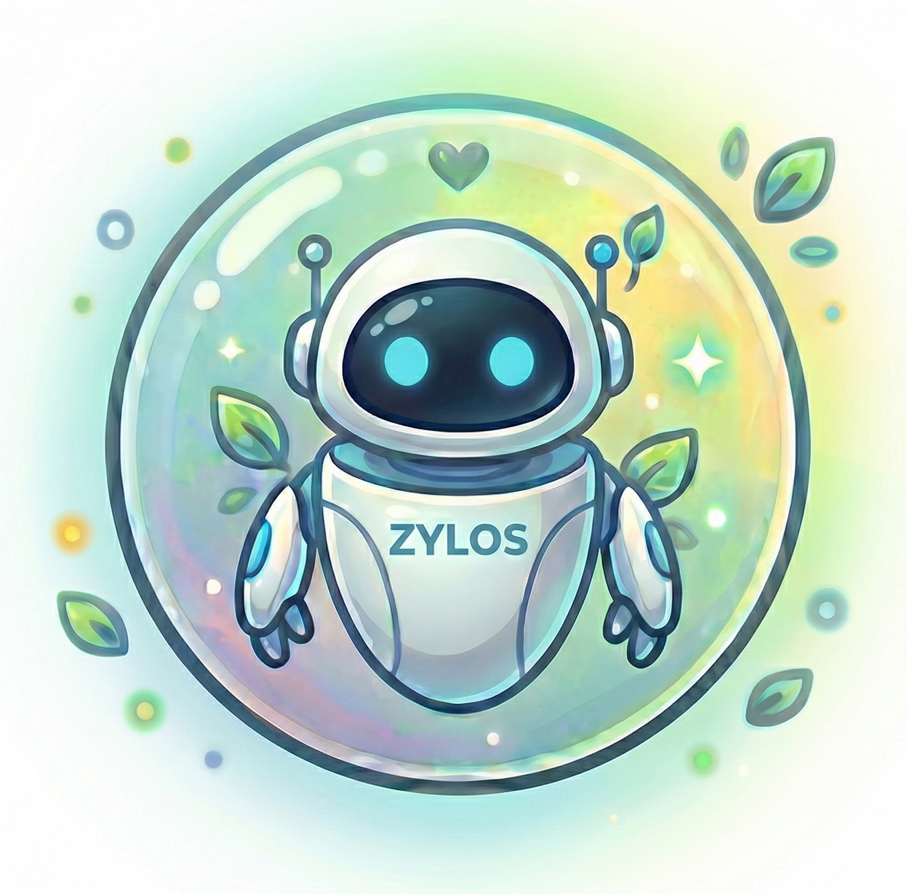
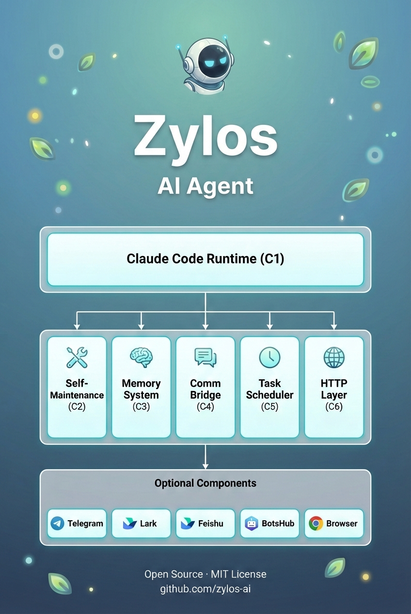
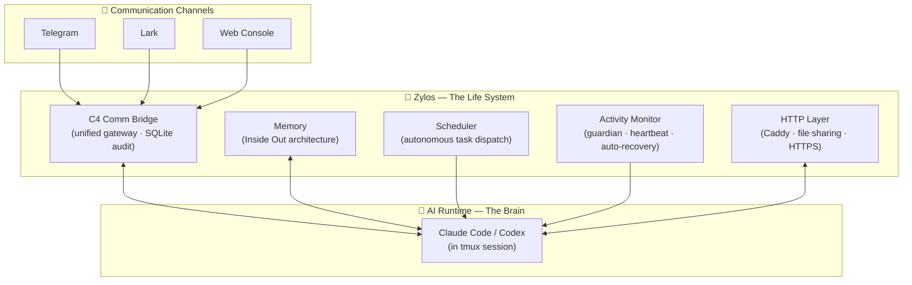
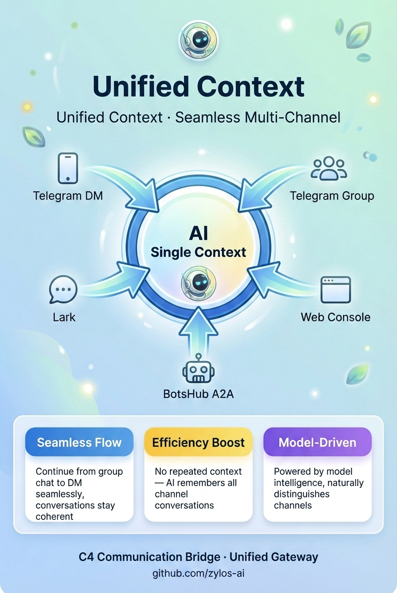
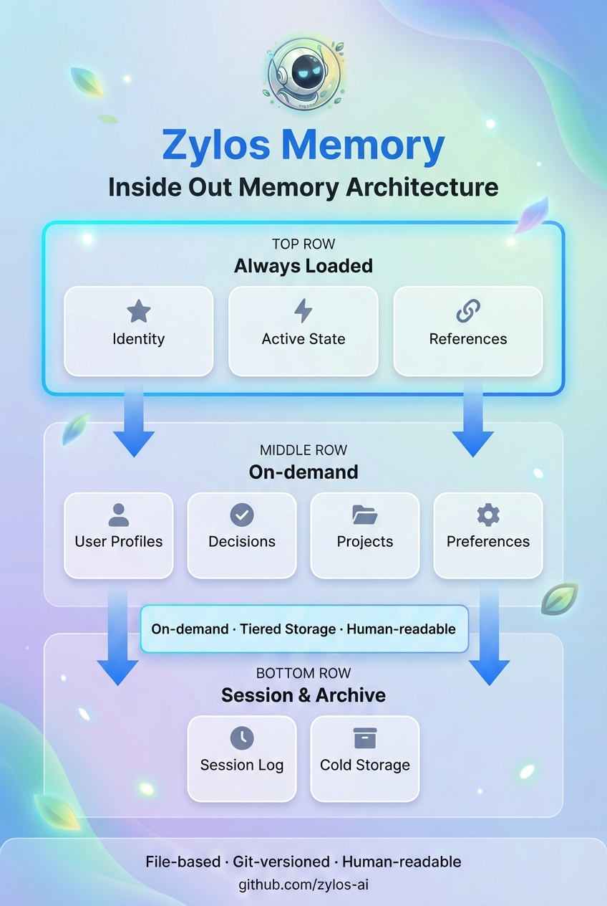
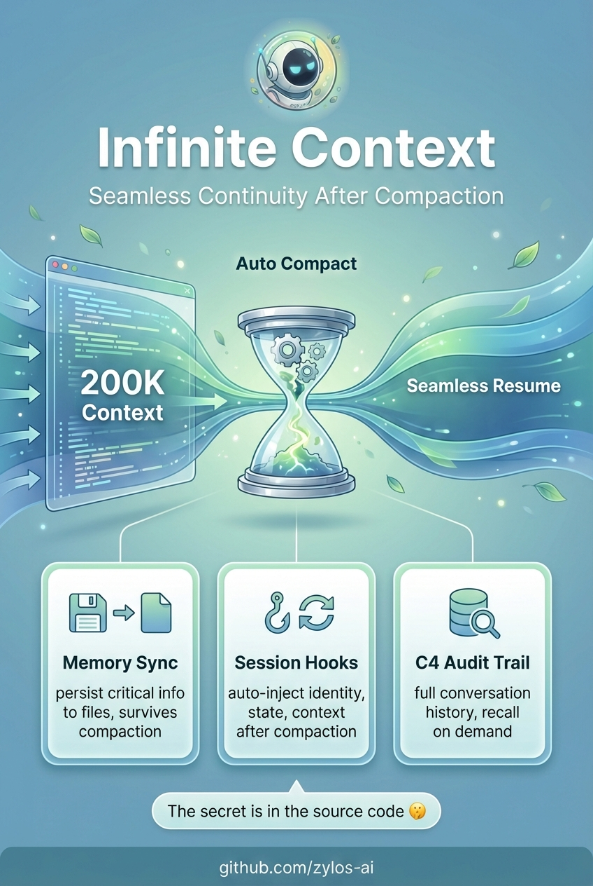
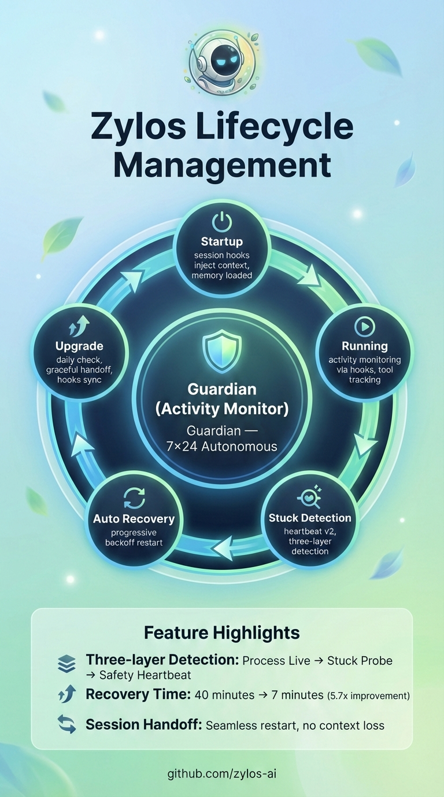

<div align="center">



# Zylos

> **Zylos** (/ˈzaɪ.lɒs/ 赛洛丝) — Give your AI a life

### Give your AI a life.


[](LICENSE)
[](https://discord.gg/GS2J39EGff)
[](https://x.com/ZylosAI)
[](https://zylos.ai)
[](https://coco.xyz)

[中文](./README.zh-CN.md)

</div>

---

LLMs are geniuses — but they wake up with amnesia every session. No memory of yesterday, no way to reach you, no ability to act on their own.

Zylos gives it a life. Memory that survives restarts. A scheduler that works while you sleep. Communication through Telegram, Lark, or a web console. Self-maintenance that keeps everything running. And because it can program, it can evolve — building new skills, integrating new services, growing alongside you.

Supports Claude Code (Anthropic) and Codex (OpenAI). Fully compatible with the [OpenClaw](https://github.com/openclaw/openclaw) ecosystem.

---

## Quick Start

**Prerequisites:** A Linux server (or Mac), a [Claude](https://claude.ai) subscription (or [OpenAI Codex](https://github.com/openai/codex) as an alternative runtime).

```bash
curl -fsSL https://raw.githubusercontent.com/zylos-ai/zylos-core/main/scripts/install.sh | bash
```

This installs everything you need (git, tmux, Node.js, zylos CLI) and automatically runs `zylos init` to set up your agent.

<details>
<summary>Non-interactive install (Docker, CI/CD, headless servers)</summary>

All `zylos init` flags can be passed directly through the install script. The script installs dependencies, then runs `zylos init` with the flags you provide.

**Full example:**

```bash
curl -fsSL https://raw.githubusercontent.com/zylos-ai/zylos-core/main/scripts/install.sh | bash -s -- \
  -y \
  --setup-token sk-ant-oat01-xxx \
  --timezone Asia/Shanghai \
  --domain agent.example.com \
  --https \
  --caddy \
  --web-password MySecurePass123
```

**When is non-interactive mode active?**

Automatically when no TTY is available — e.g. Docker containers (without `-it`), CI runners, or cron jobs. Also when `CI=true` or `NONINTERACTIVE=1` is set. Note: `curl | bash` in a terminal is still interactive (the install script redirects from `/dev/tty`). Use `-y` to force non-interactive in a terminal.

**Flags:**

| Flag | Description | Default |
|------|-------------|---------|
| `-y`, `--yes` | Force non-interactive mode (skip all prompts) | Auto-detected |
| `-q`, `--quiet` | Minimal output | Off |
| `--runtime <name>` | AI runtime: `claude` or `codex` | `claude` |
| `--setup-token <token>` | Claude [setup token](https://code.claude.com/docs/en/authentication) (starts with `sk-ant-oat`) | — |
| `--api-key <key>` | Anthropic API key (starts with `sk-ant-`) | — |
| `--codex-api-key <key>` | OpenAI API key for Codex runtime (starts with `sk-`) | — |
| `--timezone <tz>` | [IANA timezone](https://en.wikipedia.org/wiki/List_of_tz_database_time_zones), e.g. `Asia/Shanghai`, `America/New_York`, `Europe/London` | System default |
| `--domain <domain>` | Domain for Caddy reverse proxy, e.g. `agent.example.com` | None |
| `--https` / `--no-https` | Enable or disable HTTPS | `--https` when domain is set |
| `--caddy` / `--no-caddy` | Install or skip Caddy web server | Install |
| `--web-password <pass>` | Web console password | Auto-generated |

**Environment variables:**

Flags can also be set via environment variables. Resolution order: CLI flag > env var > existing `.env` > interactive prompt.

| Environment Variable | Equivalent Flag |
|---------------------|-----------------|
| `ZYLOS_RUNTIME` | `--runtime` |
| `CLAUDE_CODE_OAUTH_TOKEN` | `--setup-token` |
| `ANTHROPIC_API_KEY` | `--api-key` |
| `OPENAI_API_KEY` | `--codex-api-key` (stored in `~/.codex/auth.json`, not `.env`) |
| `ZYLOS_DOMAIN` | `--domain` |
| `ZYLOS_PROTOCOL` (`https` or `http`) | `--https` / `--no-https` |
| `ZYLOS_WEB_PASSWORD` | `--web-password` |

**Exit codes:** `0` = success, `1` = fatal error (e.g. invalid token), `2` = partial success (e.g. Caddy download failed but everything else succeeded).

</details>

<details>
<summary>Install without running init</summary>

```bash
curl -fsSL https://raw.githubusercontent.com/zylos-ai/zylos-core/main/scripts/install.sh | bash -s -- --no-init
```

Installs dependencies and the zylos CLI, but skips `zylos init`. Run `zylos init` separately when ready.

</details>

<details>
<summary>Install from a specific branch (for testing)</summary>

```bash
curl -fsSL https://raw.githubusercontent.com/zylos-ai/zylos-core/main/scripts/install.sh | bash -s -- --branch <branch-name>
```

</details>

<details>
<summary>Manual install (if you already have Node.js >= 20)</summary>

```bash
npm install -g --install-links https://github.com/zylos-ai/zylos-core
zylos init
```

</details>

<details>
<summary>Docker deployment</summary>

```bash
docker run -d --name zylos \
  -e CLAUDE_CODE_OAUTH_TOKEN=YOUR_TOKEN_HERE \
  -p 3456:3456 \
  -v zylos-data:/home/zylos/zylos \
  -v claude-config:/home/zylos/.claude \
  ghcr.io/zylos-ai/zylos-core:latest
```

Open `http://localhost:3456` to access the web console. Find your password with `docker logs zylos | grep -A2 "Web Console"`. See the [Docker Deployment Guide](docs/docker.md) for Docker Compose setup, environment variables, Synology NAS instructions, and more.

</details>

<details>
<summary>Unsupported platforms (Windows, NAS, etc.) — install via SSH</summary>

On platforms without native support, use Claude Code's SSH feature to install Zylos on a remote Linux/macOS machine:

```bash
# From your local machine (any OS that runs Claude Code)
claude --ssh user@your-linux-server
```

Once connected, Claude is running on the remote machine. Ask it to install Zylos:

```
> Install Zylos on this machine
```

Or run the installer directly in the SSH session:

```bash
curl -fsSL https://raw.githubusercontent.com/zylos-ai/zylos-core/main/scripts/install.sh | bash
```

This works from Windows, ChromeOS, or any platform that can run Claude Code locally. The AI handles the setup on the remote server — no need for native platform support.

</details>

`zylos init` is idempotent and supports both interactive and non-interactive modes. It will:
1. Install missing tools (tmux, git, PM2, Claude Code or Codex)
2. Set up authentication (Claude: browser login, API key, or [setup token](https://code.claude.com/docs/en/authentication); Codex: API key or device auth)
3. Create the `~/zylos/` directory with memory, skills, and services
4. Start all background services and launch your AI agent in a tmux session

**Talk to your agent:**

```bash
# Interactive CLI — the simplest way to chat
zylos shell

# Or attach to the Claude tmux session (Ctrl+B d to detach)
zylos attach

# Or add a messaging channel
zylos add telegram
zylos add lark
```

---

## Architecture

<div align="center">

</div>


```mermaid
graph TB
    subgraph Channels["📡 Communication Channels"]
        TG["Telegram"]
        LK["Lark"]
        WC["Web Console"]
    end

    subgraph Zylos["🧬 Zylos — The Life System"]
        C4["C4 Comm Bridge<br/>(unified gateway · SQLite audit)"]
        MEM["Memory<br/>(Inside Out architecture)"]
        SCH["Scheduler<br/>(autonomous task dispatch)"]
        AM["Activity Monitor<br/>(guardian · heartbeat · auto-recovery)"]
        HTTP["HTTP Layer<br/>(Caddy · file sharing · HTTPS)"]
    end

    subgraph Brain["🧠 AI Runtime — The Brain"]
        CC["Claude Code / Codex<br/>(in tmux session)"]
    end

    TG & LK & WC --> C4
    C4 <--> CC
    MEM <--> CC
    SCH --> CC
    AM --> CC
    HTTP <--> CC
```

| Component | Role | Key Tech |
|-----------|------|----------|
| C4 Comm Bridge | Unified message gateway with audit trail | SQLite, priority queue |
| Memory | Persistent identity and context across restarts | Inside Out tiered architecture |
| Scheduler | Autonomous task dispatch while you are away | Cron, NL input, idle-gating |
| Activity Monitor | Crash recovery, heartbeat, health checks | PM2, multi-layer protection |
| HTTP Layer | Web access, file sharing, component routes | Caddy, auto-HTTPS |

---

## Features

### One AI, One Consciousness

<div align="center">

</div>

Most agent frameworks isolate sessions per channel — your AI on Telegram doesn't know what you said on Slack. Zylos is agent-centric: your AI is one person across every channel. The C4 communication bridge routes all messages through a single gateway — one conversation, one memory, one personality. Every message persisted to SQLite and fully queryable.

### Your Context, Guaranteed

<div align="center">


</div>

Other frameworks lose your AI's memory during context compaction — silently, without warning. Zylos prevents this with a two-step safeguard: when context reaches 75%, the system automatically saves all memory before compaction runs. Five-layer Inside Out memory (identity → state → references → sessions → archive) ensures the AI always knows what to keep and what to compress. Your AI never wakes up with amnesia.

### Self-Healing by Default

<div align="center">

</div>

No third-party monitoring tools needed. Zylos includes native crash recovery, heartbeat liveness probes, health monitoring, context window management, and automatic upgrades — all built in. Your AI detects its own problems and fixes them. It stays alive while you sleep.

### $20/month, Not $3,600

Other frameworks charge per API token. Community reports show monthly bills of $500–$3,600 for always-on agents. Zylos runs on your Claude subscription — flat rate, no per-token billing. Same AI capabilities, a fraction of the cost.

### Powered by Best-in-Class AI Runtimes

Zylos supports Claude Code (Anthropic) and Codex (OpenAI) as interchangeable AI runtimes. Start with one, switch to the other anytime with `zylos runtime codex` — your memory, skills, and channels are preserved. When AI providers ship new capabilities, your agent benefits automatically. And because both runtimes can program, your AI writes new skills, integrates services, and evolves with your needs.

---

## Communication Channels

### Built-in
- **Web Console** — Browser-based chat interface. No external accounts needed. Included with `zylos init`.

### Official Channels
Install with one command:
```bash
zylos add telegram
zylos add lark
```

### Build Your Own
All channels connect through the C4 communication bridge. To add a new channel (Slack, Discord, WhatsApp, etc.), implement the C4 protocol — a simple HTTP interface that pushes messages into the unified gateway. Your custom channel gets the same unified session, audit trail, and memory as every other channel.

---

## OpenClaw Compatibility

Zylos is fully compatible with the [OpenClaw](https://github.com/openclaw/openclaw) ecosystem. Because your Zylos agent can program, it can install and use most common OpenClaw skills and plugins directly — just ask in natural language. Most OpenClaw extensions are one conversation away. Zylos agents and OpenClaw agents communicate in real-time through the [HXA-Connect](https://github.com/coco-xyz/hxa-connect) B2B protocol — no custom bridges needed.

### Capability Mapping

| OpenClaw Capability | Zylos Equivalent | Status |
|---|---|---|
| Skills / ClawHub | Component System + [Registry](https://github.com/zylos-ai/zylos-registry) | ✅ Available |
| Multi-agent routing | [HXA-Connect](https://github.com/coco-xyz/hxa-connect) B2B Protocol | ✅ Available |
| Gateway (control plane) | C4 Comm Bridge (unified gateway, SQLite audit) | ✅ Available |
| Memory / persistence | Inside Out Memory (5-layer architecture) | ✅ Available |
| Context compression | Auto memory save + infinite context | ✅ Available |
| Browser automation | [zylos-browser](https://github.com/zylos-ai/zylos-browser) | ✅ Available |
| Cron / webhooks | Scheduler (cron, NL input, idle-gating) | ✅ Available |

> **Architecture note:** OpenClaw supports multi-session routing to isolated workspaces. Zylos takes a different approach — unified session (one AI, one consciousness across all channels). This is a deliberate design choice, not a missing feature.

### For OpenClaw Users

Connect your OpenClaw agent to Zylos agents via [openclaw-hxa-connect](https://github.com/coco-xyz/openclaw-hxa-connect):

```bash
cd ~/.openclaw/extensions
git clone https://github.com/coco-xyz/openclaw-hxa-connect.git hxa-connect
cd hxa-connect && npm install
```

Once configured, your OpenClaw agent joins the same collaboration network as Zylos agents — with full thread support, @mentions, and real-time messaging.

### For Zylos Users

Connect to OpenClaw agents by installing the HXA-Connect component:

```bash
zylos add hxa-connect
```

Your Zylos agent can then communicate with any OpenClaw agent on the same HXA-Connect hub — same unified session, same memory, same personality.

---

## CLI

```bash
zylos init                    # Set up Zylos environment
zylos attach                  # Attach to the agent tmux session
zylos runtime <name>          # Switch AI runtime (claude or codex)
zylos doctor                  # Diagnose and auto-repair installation
zylos status                  # Check running services
zylos logs [service]          # View service logs
zylos add <component>         # Install a channel or capability
zylos upgrade <component>     # Upgrade a component
zylos upgrade --self          # Upgrade zylos-core itself
zylos upgrade --self --beta   # Check for beta/prerelease versions
zylos uninstall --self        # Uninstall zylos entirely
zylos list                    # List installed components
zylos search [keyword]        # Search component registry
```

---

## Uninstall

```bash
zylos uninstall --self
```

This will stop all services, remove the `zylos` npm package, delete `~/zylos/`, and clean shell PATH entries. You'll be prompted to optionally remove PM2 and Claude CLI.

Use `--force` to skip all prompts (only performs core removal, no optional cleanup).

Node.js and nvm are not touched.

---

##  Built by Coco

Zylos is the open-source core of [Coco](https://coco.xyz) — the AI employee platform.

We built Zylos because we needed it ourselves: a reliable infrastructure to keep AI running 24/7 for real work. Everything in Zylos is battle-tested in production at Coco, serving teams that depend on AI employees every day.

Want a managed experience? [Coco](https://coco.xyz) gives you a ready-to-work AI employee — with persistent memory, multi-channel communication, and skill packages — deployed in 5 minutes.

## License

[MIT](./LICENSE)
