<div align="center">


# Zylos

> **Zylos** (/ˈzaɪ.lɒs/ 赛洛丝) — Give your AI a life

### Give your AI a life.


[](LICENSE)
[](https://discord.gg/GS2J39EGff)
[](https://x.com/ZylosAI)
[](https://zylos.ai)
[](https://coco.xyz)

[中文](./README.zh-CN.md)

</div>

---

LLMs are geniuses — but they wake up with amnesia every session. No memory of yesterday, no way to reach you, no ability to act on their own.

Zylos gives it a life. Memory that survives restarts. A scheduler that works while you sleep. Communication through Telegram, Lark, or a web console. Self-maintenance that keeps everything running. And because it can program, it can evolve — building new skills, integrating new services, growing alongside you.

More LLMs support are on the way.

---

## Quick Start

**Prerequisites:** A Linux server (or Mac), a [Claude](https://claude.ai) subscription.

```bash
curl -fsSL https://raw.githubusercontent.com/zylos-ai/zylos-core/main/scripts/install.sh | bash
```

This installs everything you need (git, tmux, Node.js, zylos CLI) and automatically runs `zylos init` to set up your agent.

> If you already have Node.js installed, the script will print a "next step" prompt — just run `zylos init` manually.

<details>
<summary>Non-interactive install (Docker, CI/CD, headless servers)</summary>

All `zylos init` flags can be passed directly through the install script. The script installs dependencies, then runs `zylos init` with the flags you provide.

**Full example:**

```bash
curl -fsSL https://raw.githubusercontent.com/zylos-ai/zylos-core/main/scripts/install.sh | bash -s -- \
  -y \
  --setup-token sk-ant-oat01-xxx \
  --timezone Asia/Shanghai \
  --domain agent.example.com \
  --https \
  --caddy \
  --web-password MySecurePass123
```

**Minimal example** (only authentication, everything else uses defaults):

```bash
curl -fsSL https://raw.githubusercontent.com/zylos-ai/zylos-core/main/scripts/install.sh | bash -s -- \
  --setup-token sk-ant-oat01-xxx
```

**When is non-interactive mode active?**

Automatically when stdin is not a TTY (Docker, `curl | bash` piped execution, CI runners). Also when `CI=true` or `NONINTERACTIVE=1` is set. Use `-y` to force non-interactive in a terminal session.

**Flags:**

| Flag | Description | Default |
|------|-------------|---------|
| `-y`, `--yes` | Force non-interactive mode (skip all prompts) | Auto-detected |
| `-q`, `--quiet` | Minimal output | Off |
| `--setup-token <token>` | Claude [setup token](https://code.claude.com/docs/en/authentication) (starts with `sk-ant-oat`) | — |
| `--api-key <key>` | Anthropic API key (starts with `sk-ant-`) | — |
| `--timezone <tz>` | [IANA timezone](https://en.wikipedia.org/wiki/List_of_tz_database_time_zones), e.g. `Asia/Shanghai`, `America/New_York`, `Europe/London` | System default |
| `--domain <domain>` | Domain for Caddy reverse proxy, e.g. `agent.example.com` | None |
| `--https` / `--no-https` | Enable or disable HTTPS | `--https` when domain is set |
| `--caddy` / `--no-caddy` | Install or skip Caddy web server | Install |
| `--web-password <pass>` | Web console password | Auto-generated |

**Environment variables:**

Flags can also be set via environment variables. Resolution order: CLI flag > env var > existing `.env` > interactive prompt.

| Environment Variable | Equivalent Flag |
|---------------------|-----------------|
| `CLAUDE_CODE_OAUTH_TOKEN` | `--setup-token` |
| `ANTHROPIC_API_KEY` | `--api-key` |
| `ZYLOS_DOMAIN` | `--domain` |
| `ZYLOS_PROTOCOL` (`https` or `http`) | `--https` / `--no-https` |
| `ZYLOS_WEB_PASSWORD` | `--web-password` |

> **Security note:** `--setup-token` and `--api-key` values are visible in process listings (`ps`). On shared systems, prefer environment variables instead:
> ```bash
> CLAUDE_CODE_OAUTH_TOKEN=sk-ant-oat01-xxx zylos init -y
> ```

**Exit codes:** `0` = success, `1` = fatal error (e.g. invalid token), `2` = partial success (e.g. Caddy download failed but everything else succeeded).

</details>

<details>
<summary>Install without running init</summary>

```bash
curl -fsSL https://raw.githubusercontent.com/zylos-ai/zylos-core/main/scripts/install.sh | bash -s -- --no-init
```

Installs dependencies and the zylos CLI, but skips `zylos init`. Run `zylos init` separately when ready.

</details>

<details>
<summary>Install from a specific branch (for testing)</summary>

```bash
curl -fsSL https://raw.githubusercontent.com/zylos-ai/zylos-core/main/scripts/install.sh | bash -s -- --branch <branch-name>
```

</details>

<details>
<summary>Manual install (if you already have Node.js >= 20)</summary>

```bash
npm install -g --install-links https://github.com/zylos-ai/zylos-core
zylos init
```

</details>

`zylos init` is idempotent and supports both interactive and non-interactive modes. It will:
1. Install missing tools (tmux, git, PM2, Claude Code)
2. Set up Claude authentication (browser login, API key, or [setup token](https://code.claude.com/docs/en/authentication) for headless servers)
3. Create the `~/zylos/` directory with memory, skills, and services
4. Start all background services and launch Claude in a tmux session

**Talk to your agent:**

```bash
# Attach to the Claude session (Ctrl+B d to detach)
zylos attach

# Or add a messaging channel
zylos add telegram
zylos add lark
```

---

## Architecture

```mermaid
graph TB
    subgraph Channels["📡 Communication Channels"]
        TG["Telegram"]
        LK["Lark"]
        WC["Web Console"]
    end

    subgraph Zylos["🧬 Zylos — The Life System"]
        C4["C4 Comm Bridge<br/>(unified gateway · SQLite audit)"]
        MEM["Memory<br/>(Inside Out architecture)"]
        SCH["Scheduler<br/>(autonomous task dispatch)"]
        AM["Activity Monitor<br/>(guardian · heartbeat · auto-recovery)"]
        HTTP["HTTP Layer<br/>(Caddy · file sharing · HTTPS)"]
    end

    subgraph Brain["🧠 Claude Code — The Brain"]
        CC["Claude Code<br/>(in tmux session)"]
    end

    TG & LK & WC --> C4
    C4 <--> CC
    MEM <--> CC
    SCH --> CC
    AM --> CC
    HTTP <--> CC
```

<div align="center">

</div>



| Component | Role | Key Tech |
|-----------|------|----------|
| C4 Comm Bridge | Unified message gateway with audit trail | SQLite, priority queue |
| Memory | Persistent identity and context across restarts | Inside Out tiered architecture |
| Scheduler | Autonomous task dispatch while you are away | Cron, NL input, idle-gating |
| Activity Monitor | Crash recovery, heartbeat, health checks | PM2, multi-layer protection |
| HTTP Layer | Web access, file sharing, component routes | Caddy, auto-HTTPS |

---

## Features

### One AI, One Consciousness

<div align="center">

</div>

Most agent frameworks isolate sessions per channel — your AI on Telegram doesn't know what you said on Slack. Zylos is agent-centric: your AI is one person across every channel. The C4 communication bridge routes all messages through a single gateway — one conversation, one memory, one personality. Every message persisted to SQLite and fully queryable.

### Your Context, Guaranteed

<div align="center">


</div>

Other frameworks lose your AI's memory during context compaction — silently, without warning. Zylos prevents this with a two-step safeguard: when context reaches 75%, the system automatically saves all memory before compaction runs. Five-layer Inside Out memory (identity → state → references → sessions → archive) ensures the AI always knows what to keep and what to compress. Your AI never wakes up with amnesia.

### Self-Healing by Default

<div align="center">

</div>

No third-party monitoring tools needed. Zylos includes native crash recovery, heartbeat liveness probes, health monitoring, context window management, and automatic upgrades — all built in. Your AI detects its own problems and fixes them. It stays alive while you sleep.

### $20/month, Not $3,600

Other frameworks charge per API token. Community reports show monthly bills of $500–$3,600 for always-on agents. Zylos runs on your Claude subscription — flat rate, no per-token billing. Same AI capabilities, a fraction of the cost.

### Powered by Claude Code

Zylos builds on Claude Code — Anthropic's official AI agent runtime. When Anthropic ships new capabilities like agent teams, your AI gets them automatically. And because Claude Code can program, your AI writes new skills, integrates services, and evolves with your needs.

---

## Communication Channels

### Built-in
- **Web Console** — Browser-based chat interface. No external accounts needed. Included with `zylos init`.

### Official Channels
Install with one command:
```bash
zylos add telegram
zylos add lark
```

### Build Your Own
All channels connect through the C4 communication bridge. To add a new channel (Slack, Discord, WhatsApp, etc.), implement the C4 protocol — a simple HTTP interface that pushes messages into the unified gateway. Your custom channel gets the same unified session, audit trail, and memory as every other channel.

---

## CLI

```bash
zylos init                    # Set up Zylos environment
zylos status                  # Check running services
zylos logs [service]          # View service logs
zylos add <component>         # Install a channel or capability
zylos upgrade <component>     # Upgrade a component
zylos list                    # List installed components
zylos search [keyword]        # Search component registry
```

---

##  Built by Coco

Zylos is the open-source core of [Coco](https://coco.xyz) — the AI employee platform.

We built Zylos because we needed it ourselves: a reliable infrastructure to keep AI running 24/7 for real work. Everything in Zylos is battle-tested in production at Coco, serving teams that depend on AI employees every day.

Want a managed experience? [Coco](https://coco.xyz) gives you a ready-to-work AI employee — with persistent memory, multi-channel communication, and skill packages — deployed in 5 minutes.

## License

[MIT](./LICENSE)
