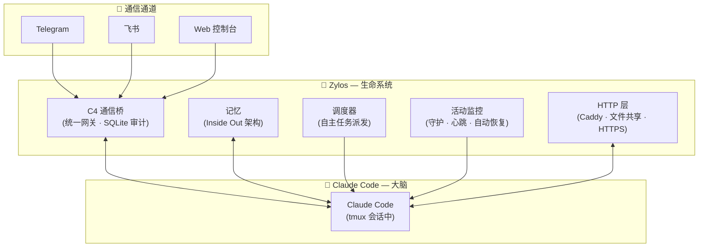
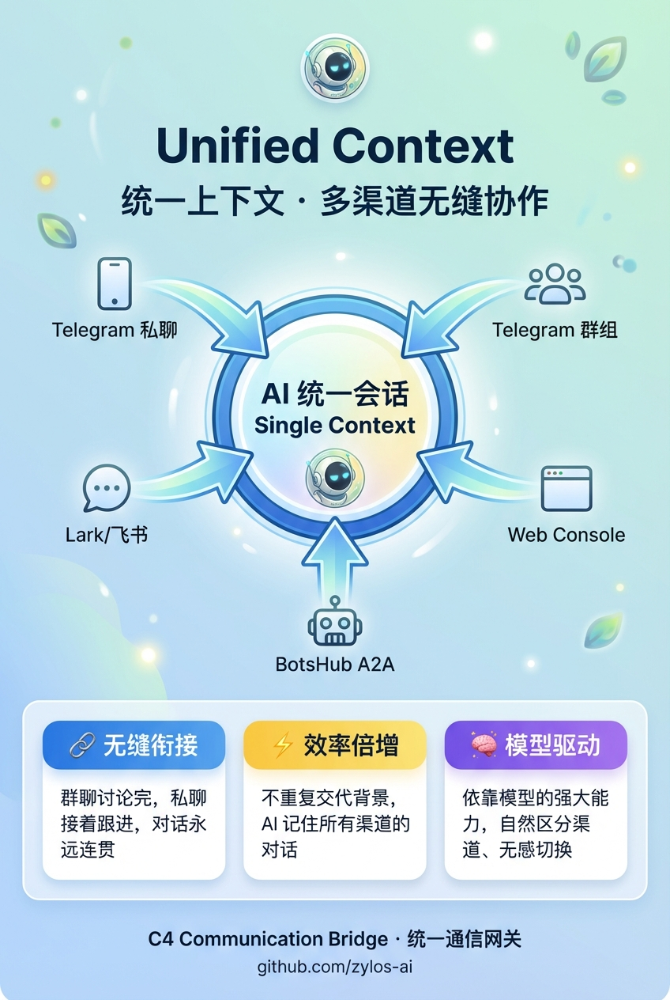
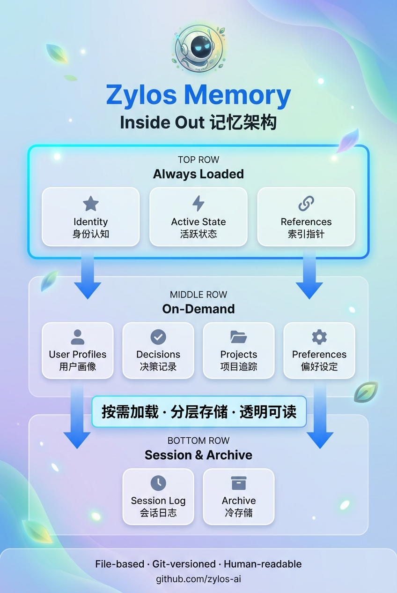
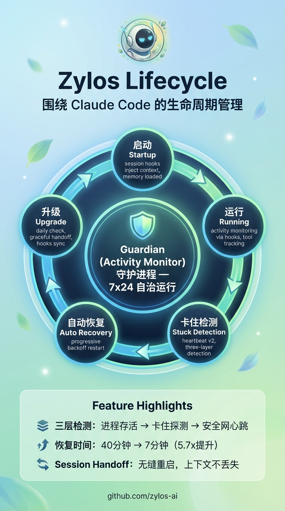

<div align="center">


# Zylos

### 给你的 AI 一个生命。

*为团队协作*

[](LICENSE)
[](https://discord.gg/GS2J39EGff)
[](https://x.com/ZylosAI)
[](https://zylos.ai)
[](https://coco.xyz)

[English](./README.md)

</div>

---

LLMs 是天才 — 但他们每次醒来都失忆。不记得昨天做了什么，联系不到你，也无法自主行动。

Zylos 给它一个生命。跨重启的持久记忆。你睡觉时自动工作的调度器。通过 Telegram、飞书或 Web 控制台与你沟通。自我维护让一切持续运行。而且因为它会编程，它可以进化 — 构建新技能、集成新服务，与你一起成长。

更多模型支持在路上...

---

## 快速开始

**前置条件：** 一台 Linux 服务器（或 Mac）、[Claude](https://claude.ai) 订阅。

```bash
curl -fsSL https://raw.githubusercontent.com/zylos-ai/zylos-core/main/scripts/install.sh | bash
```

一键安装所有依赖（git、tmux、Node.js、zylos CLI），并自动运行 `zylos init` 完成初始化。

> 如果你已有 Node.js，安装脚本会提示下一步 — 手动运行 `zylos init` 即可。

<details>
<summary>非交互式安装（Docker、CI/CD、无界面服务器）</summary>

所有 `zylos init` 参数都可以直接传给安装脚本。脚本会先安装依赖，然后带着你的参数运行 `zylos init`。

**完整示例：**

```bash
curl -fsSL https://raw.githubusercontent.com/zylos-ai/zylos-core/main/scripts/install.sh | bash -s -- \
  -y \
  --setup-token sk-ant-oat01-xxx \
  --timezone Asia/Shanghai \
  --domain agent.example.com \
  --https \
  --caddy \
  --web-password MySecurePass123
```

**最小示例**（只提供认证，其他使用默认值）：

```bash
curl -fsSL https://raw.githubusercontent.com/zylos-ai/zylos-core/main/scripts/install.sh | bash -s -- \
  --setup-token sk-ant-oat01-xxx
```

**何时自动进入非交互模式？**

stdin 不是 TTY 时自动启用（Docker、管道执行的 `curl | bash`、CI 环境）。设置 `CI=true` 或 `NONINTERACTIVE=1` 也会启用。在终端中用 `-y` 可强制跳过所有提示。

**参数说明：**

| 参数 | 说明 | 默认值 |
|------|------|--------|
| `-y`, `--yes` | 强制非交互模式（跳过所有提示） | 自动检测 |
| `-q`, `--quiet` | 精简输出 | 关闭 |
| `--setup-token <token>` | Claude [setup token](https://code.claude.com/docs/en/authentication)（以 `sk-ant-oat` 开头） | — |
| `--api-key <key>` | Anthropic API key（以 `sk-ant-` 开头） | — |
| `--timezone <tz>` | [IANA 时区](https://en.wikipedia.org/wiki/List_of_tz_database_time_zones)，如 `Asia/Shanghai`、`America/New_York`、`Europe/London` | 系统默认 |
| `--domain <domain>` | Caddy 反向代理域名，如 `agent.example.com` | 无 |
| `--https` / `--no-https` | 启用或禁用 HTTPS | 设置域名时默认 `--https` |
| `--caddy` / `--no-caddy` | 安装或跳过 Caddy Web 服务器 | 安装 |
| `--web-password <pass>` | Web 控制台密码 | 自动生成 |

**环境变量：**

参数也可通过环境变量设置。优先级：CLI 参数 > 环境变量 > 已有 `.env` > 交互式提示。

| 环境变量 | 对应参数 |
|---------|---------|
| `CLAUDE_CODE_OAUTH_TOKEN` | `--setup-token` |
| `ANTHROPIC_API_KEY` | `--api-key` |
| `ZYLOS_DOMAIN` | `--domain` |
| `ZYLOS_PROTOCOL`（`https` 或 `http`） | `--https` / `--no-https` |
| `ZYLOS_WEB_PASSWORD` | `--web-password` |

**退出码：** `0` = 成功，`1` = 致命错误（如无效 token），`2` = 部分成功（如 Caddy 下载失败但其他步骤正常）。

</details>

<details>
<summary>仅安装环境，不运行 init</summary>

```bash
curl -fsSL https://raw.githubusercontent.com/zylos-ai/zylos-core/main/scripts/install.sh | bash -s -- --no-init
```

安装依赖和 zylos CLI，但跳过 `zylos init`。之后手动运行 `zylos init` 即可。

</details>

<details>
<summary>从指定分支安装（用于测试）</summary>

```bash
curl -fsSL https://raw.githubusercontent.com/zylos-ai/zylos-core/main/scripts/install.sh | bash -s -- --branch <branch-name>
```

</details>

<details>
<summary>手动安装（如果你已有 Node.js >= 20）</summary>

```bash
npm install -g --install-links https://github.com/zylos-ai/zylos-core
zylos init
```

</details>

`zylos init` 可重复运行，支持交互式和非交互式两种模式。它会：
1. 安装缺失的工具（tmux、git、PM2、Claude Code）
2. 配置 Claude 认证（浏览器登录、API key 或 [setup token](https://code.claude.com/docs/en/authentication)，适用于无浏览器的服务器）
3. 创建 `~/zylos/` 目录，包含记忆、技能和服务
4. 启动所有后台服务，并在 tmux 会话中启动 Claude

**与你的智能体对话：**

```bash
# 连接到 Claude 会话（Ctrl+B d 退出）
zylos attach

# 或添加消息通道
zylos add telegram
zylos add lark
```

---

## 架构

<div align="center">

</div>



| 组件 | 职责 | 关键技术 |
|------|------|----------|
| C4 通信桥 | 统一消息网关，带审计追踪 | SQLite、优先级队列 |
| 记忆 | 跨重启的持久身份和上下文 | Inside Out 分层架构 |
| 调度器 | 你不在时自主派发任务 | Cron、自然语言输入、空闲门控 |
| 活动监控 | 崩溃恢复、心跳、健康检查 | PM2、多层保护 |
| HTTP 层 | Web 访问、文件共享、组件路由 | Caddy、自动 HTTPS |

---

## 特性

### 一个 AI，一个意识

<div align="center">

</div>

大多数智能体框架按通道隔离会话 — 你在 Telegram 上的 AI 不知道你在 Slack 上说了什么。Zylos 以智能体为中心：你的 AI 在所有通道上是同一个人。C4 通信桥将所有消息路由到统一网关 — 一个对话、一份记忆、一个人格。每条消息都持久化到 SQLite，完全可查询。

### 你的上下文，有保障

<div align="center">


</div>

其他框架在上下文压缩时会丢失 AI 的记忆 — 悄无声息，没有预警。Zylos 用两步保障机制防止这种情况：当上下文达到 75% 时，系统自动保存所有记忆，然后才执行压缩。五层 Inside Out 记忆架构（身份 → 状态 → 参考 → 会话 → 归档）确保 AI 始终知道该保留什么、压缩什么。你的 AI 不会再失忆醒来。

### 默认自愈

<div align="center">

</div>

不需要第三方监控工具。Zylos 内置了崩溃恢复、心跳探活、健康监控、上下文窗口管理和自动升级。你的 AI 自己发现问题并修复。你睡觉时它依然活着。

### 每月 $20，而不是 $3,600

其他框架按 API token 计费。社区反馈显示常驻智能体的月费在 $500–$3,600。Zylos 运行在你的 Claude 订阅上 — 固定费率，无逐 token 计费。同样的 AI 能力，成本只是零头。

### 基于 Claude Code

Zylos 构建在 Claude Code 之上 — Anthropic 官方的 AI 智能体运行时。当 Anthropic 发布新功能（如智能体团队），你的 AI 自动获得。而且因为 Claude Code 会编程，你的 AI 可以编写新技能、集成服务，随需求进化。

---

## 通信通道

### 内置
- **Web 控制台** — 浏览器端聊天界面。无需外部账号。`zylos init` 自带。

### 官方通道
一条命令安装：
```bash
zylos add telegram
zylos add lark
```

### 自定义通道
所有通道通过 C4 通信桥连接。要添加新通道（Slack、Discord、WhatsApp 等），实现 C4 协议 — 一个简单的 HTTP 接口，将消息推入统一网关。你的自定义通道获得与其他通道相同的统一会话、审计追踪和记忆。

---

## CLI

```bash
zylos init                    # 初始化 Zylos 环境
zylos status                  # 查看运行中的服务
zylos logs [service]          # 查看服务日志
zylos add <component>         # 安装通道或能力组件
zylos upgrade <component>     # 升级组件
zylos list                    # 列出已安装组件
zylos search [keyword]        # 搜索组件注册表
```

---

##  由 Coco 构建

Zylos 是 [Coco](https://coco.xyz)（AI 员工平台）的开源核心基础设施。

我们构建 Zylos 是因为我们自己需要它：可靠的基础设施，让 AI 24/7 稳定运行在真实工作中。Zylos 中的每个组件都在 Coco 生产环境中经过实战检验，服务于每天依赖 AI 员工的团队。

想要开箱即用？[Coco](https://coco.xyz) 提供即开即用的 AI 员工 — 持久记忆、多渠道沟通、技能包 — 5 分钟完成部署。

## 许可证

[MIT](./LICENSE)
