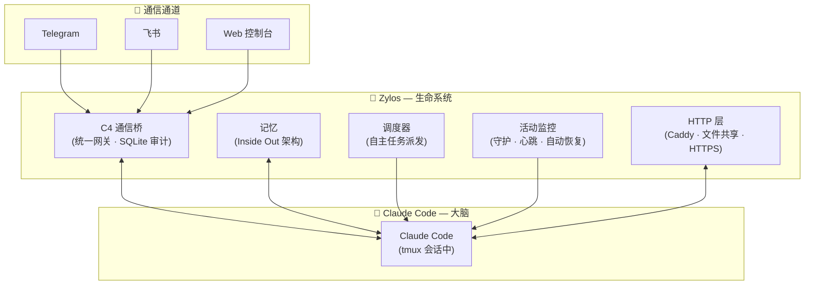

<div align="center">


# Zylos

### 给你的 AI 一个生命。

*基于 Claude Code*

[](LICENSE)
[](https://discord.gg/vbcR7MWe)
[](https://x.com/ZylosAI)
[](https://zylos.ai)
[](https://coco.xyz)

[English](./README.md)

</div>

---

Claude Code 是个天才 — 但它每次醒来都失忆。不记得昨天做了什么，联系不到你，也无法自主行动。

Zylos 给它一个生命。跨重启的持久记忆。你睡觉时自动工作的调度器。通过 Telegram、飞书或 Web 控制台与你沟通。自我维护让一切持续运行。而且因为 Claude Code 会编程，它可以进化 — 构建新技能、集成新服务，与你一起成长。

---

## 快速开始

**前置条件：** Node.js >= 20、一台 Linux 服务器（或 Mac）、以及 [Claude](https://claude.ai) 订阅。

```bash
# 安装（--install-links 是 GitHub 安装所需参数，后续会发布到 npm）
npm install -g --install-links https://github.com/zylos-ai/zylos-core

# 初始化 — 设置 tmux、PM2、记忆系统、调度器等
zylos init
```

`zylos init` 是交互式的，可重复运行。它会：
1. 安装缺失的工具（tmux、git、PM2、Claude Code）
2. 引导你完成 Claude 认证
3. 创建 `~/zylos/` 目录，包含记忆、技能和服务
4. 启动所有后台服务，并在 tmux 会话中启动 Claude

**与你的智能体对话：**

```bash
# 连接到 Claude 会话
tmux attach -t claude-main

# 或添加消息通道
zylos add telegram
zylos add lark
```

---

## 特性

### 一个 AI，一个意识

大多数智能体框架按通道隔离会话 — 你在 Telegram 上的 AI 不知道你在 Slack 上说了什么。Zylos 以智能体为中心：你的 AI 在所有通道上是同一个人。C4 通信桥将所有消息路由到统一网关 — 一个对话、一份记忆、一个人格。每条消息都持久化到 SQLite，完全可查询。

### 你的上下文，有保障

其他框架在上下文压缩时会丢失 AI 的记忆 — 悄无声息，没有预警。Zylos 用两步保障机制防止这种情况：当上下文达到 75% 时，系统自动保存所有记忆，然后才执行压缩。五层 Inside Out 记忆架构（身份 → 状态 → 参考 → 会话 → 归档）确保 AI 始终知道该保留什么、压缩什么。你的 AI 不会再失忆醒来。

### 默认自愈

不需要第三方监控工具。Zylos 内置了崩溃恢复、心跳探活、健康监控、上下文窗口管理和自动升级。你的 AI 自己发现问题并修复。你睡觉时它依然活着。

### 每月 $20，而不是 $3,600

其他框架按 API token 计费。社区反馈显示常驻智能体的月费在 $500–$3,600。Zylos 运行在你的 Claude 订阅上 — 固定费率，无逐 token 计费。同样的 AI 能力，成本只是零头。

### 基于 Claude Code

Zylos 构建在 Claude Code 之上 — Anthropic 官方的 AI 智能体运行时。当 Anthropic 发布新功能（如智能体团队），你的 AI 自动获得。而且因为 Claude Code 会编程，你的 AI 可以编写新技能、集成服务，随需求进化。

---

## 架构



| 组件 | 职责 | 关键技术 |
|------|------|----------|
| C4 通信桥 | 统一消息网关，带审计追踪 | SQLite、优先级队列 |
| 记忆 | 跨重启的持久身份和上下文 | Inside Out 分层架构 |
| 调度器 | 你不在时自主派发任务 | Cron、自然语言输入、空闲门控 |
| 活动监控 | 崩溃恢复、心跳、健康检查 | PM2、多层保护 |
| HTTP 层 | Web 访问、文件共享、组件路由 | Caddy、自动 HTTPS |

---

## 通信通道

### 内置
- **Web 控制台** — 浏览器端聊天界面。无需外部账号。`zylos init` 自带。

### 官方通道
一条命令安装：
```bash
zylos add telegram
zylos add lark
```

### 自定义通道
所有通道通过 C4 通信桥连接。要添加新通道（Slack、Discord、WhatsApp 等），实现 C4 协议 — 一个简单的 HTTP 接口，将消息推入统一网关。你的自定义通道获得与其他通道相同的统一会话、审计追踪和记忆。

---

## CLI

```bash
zylos init                    # 初始化 Zylos 环境
zylos status                  # 查看运行中的服务
zylos logs [service]          # 查看服务日志
zylos add <component>         # 安装通道或能力组件
zylos upgrade <component>     # 升级组件
zylos list                    # 列出已安装组件
zylos search [keyword]        # 搜索组件注册表
```

---

##  由 Coco 构建

Zylos 是 [Coco](https://coco.xyz)（AI 员工平台）的开源核心基础设施。

我们构建 Zylos 是因为我们自己需要它：可靠的基础设施，让 AI 24/7 稳定运行在真实工作中。Zylos 中的每个组件都在 Coco 生产环境中经过实战检验，服务于每天依赖 AI 员工的团队。

想要开箱即用？[Coco](https://coco.xyz) 提供即开即用的 AI 员工 — 持久记忆、多渠道沟通、技能包 — 5 分钟完成部署。

## 许可证

[MIT](./LICENSE)
