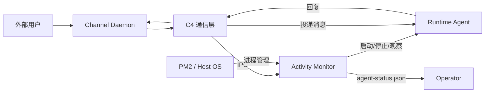
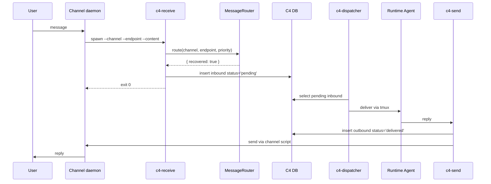
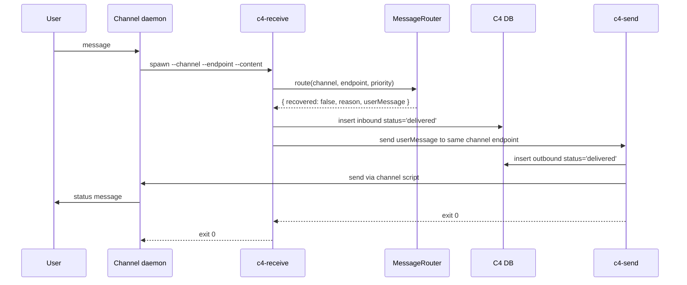

# Activity Monitor 技术方案

> 状态：Draft
> 日期：2026-04-28

---

## 1. Context：系统上下文

### 1.1 系统目标

Activity Monitor 是 Zylos runtime 的本地守护系统。它负责观察、诊断、恢复 Claude / Codex 等交互式 runtime，并在 runtime 不健康时让外部用户得到一致、可解释的反馈。

它不负责理解业务消息内容，也不负责判断"某条用户消息是否已经被 agent 回复"。这些仍由 agent 与 C4 通信层承担。

### 1.2 外部上下文

以 Activity Monitor 为中心，以下是与之交互的外部系统和角色：

| 外部上下文 | 定义 | 与 AM 的关系 | 职责边界 |
|---|---|---|---|
| 外部用户 | 通过 Lark / Telegram / Web Console / HXA-Connect 发消息的终端用户 | 消息经 C4 通信层到达 AM 的 MessageRouter | 用户不直接与 AM 交互；AM 通过 C4 通信层间接向用户返回状态文案 |
| C4 通信层 | 包含 c4-receive、c4-send、c4-dispatcher、C4 DB 的消息通信子系统 | c4-receive 通过 IPC 调用 AM 的 MessageRouter 获取路由决策；c4-receive 本身不判断健康状态，无状态，每次调用独立 | C4 负责消息的接收、持久化、投递、发送；AM 负责健康判断和路由决策。AM 不直接绕过 C4 主链向 runtime 投递用户消息 |
| Channel Daemon | 各平台（Lark / Telegram / Web Console）的入口进程 | 调用 c4-receive 后按 exit code 判断是否成功 | Channel Daemon 负责平台协议适配和消息收发；AM 对外状态只通过 `agent-status.json` 暴露，内部状态不泄漏给 Channel Daemon |
| Runtime Agent | Claude / Codex 交互式进程（运行在 tmux 中） | AM 启动、停止、观察 runtime；通过 Adapter 封装 runtime 差异 | AM 管理 runtime 生命周期和健康状态；runtime 负责业务消息处理。C4 Dispatcher 是用户消息进入 runtime 的唯一主链写入者 |
| Operator | 系统维护者 | 通过 `agent-status.json` 了解系统状态 | Operator 关注可观测状态和恢复策略 |
| PM2 / Host OS | 进程运行环境 | PM2 管理 AM 进程的长驻和重启 | PM2 负责进程生命周期；AM 在其上实现业务守护逻辑 |

### 1.3 上下文图



---

## 2. Containers：容器级架构

### 2.1 容器清单

按所属上下文分组：

#### Activity Monitor（本模块）

| Container | 类型 | 职责 | 入口交互 | 出口交互 |
|---|---|---|---|---|
| AM Process | PM2 long-running process | 主循环编排、状态机、runtime 生命周期管理。内部通过 signal files（JSON/JSONL）存取状态 | runtime 进程状态变化（退出/启动/冻结）；HealthEngine 健康状态转移；signal file 更新（工具事件、进程采样） | 调用 Runtime Adapter 启停 runtime；写 `agent-status.json` 对外暴露状态；触发健康目录动作（通知、重启决策） |
| MessageRouter | 一次性调用接口 | 接收 c4-receive 的路由请求，查询 AM 健康状态，返回路由决策（健康/不健康 + 用户文案） | c4-receive 调用 | 返回路由决策给 c4-receive |
| Runtime Adapter | AM 内部 DI 层 | 封装 Claude / Codex runtime 差异，向 AM 业务组件提供统一接口 | AM Process 各组件调用 | 操作 Runtime Agent Process（启动/停止/探测） |

#### C4 通信层

| Container | 类型 | 职责 | 入口交互 | 出口交互 |
|---|---|---|---|---|
| C4 Receive CLI | per-message Node process | 外部消息入口；调用 AM MessageRouter 获取路由决策并据此行动；写 inbound DB | Channel Daemon spawn 调用 | 写 C4 DB；通过 IPC 调用 AM MessageRouter；unhealthy 时调用 C4 Send CLI |
| C4 Send CLI | per-message Node process | agent/系统对外发送消息 | Runtime Agent 或 c4-receive 调用 | 写 C4 DB outbound；调用 Channel Daemon send script |
| C4 Dispatcher | PM2 long-running process | 消费 C4 DB 中 `status='pending'` 的 inbound，投递给 runtime | 轮询 C4 DB | 通过 tmux 投递给 Runtime Agent |
| C4 DB | SQLite | C4 消息可靠性边界，存储 inbound/outbound 消息记录 | c4-receive / c4-send / c4-dispatcher 读写 | 被 c4-dispatcher 消费 |

#### Channel Daemon

| Container | 类型 | 职责 | 入口交互 | 出口交互 |
|---|---|---|---|---|
| Channel Daemons | PM2/process | 平台协议适配（Lark / Telegram / Web Console 等），消息收发 | 外部用户消息到达 | spawn c4-receive 处理 inbound；被 c4-send channel script 调用发送 outbound |

#### Runtime Agent

| Container | 类型 | 职责 | 入口交互 | 出口交互 |
|---|---|---|---|---|
| Runtime Agent Process | tmux interactive process | 真实 agent 工作循环（Claude / Codex） | C4 Dispatcher 投递用户消息；AM 通过 Adapter 启停 | 调用 C4 Send CLI 回复用户 |

### 2.2 容器交互

#### OK 路径



#### Unhealthy 状态文案路径



---

## 3. Components：组件级设计

### 3.1 内部组件

| Component | 所属容器 | 职责 | 输入 | 输出 |
|---|---|---|---|---|
| Monitor Orchestrator | AM Process | 每秒 tick 编排；启动 IPC | clock, config | component calls |
| SignalStore | AM Process | tick 开头读信号，产出 immutable snapshot | signal files | readonly snapshot |
| StatusWriter | AM Process | tick 末尾写对外状态 | snapshot, HealthEngine | `agent-status.json` |
| Guardian | AM Process | runtime 进程存活守护 | snapshot, guardian state | `adapter.launch()`, HealthEngine events |
| ProcSampler | AM Process | OS 级冻结检测 | pid/context switch | `proc-state.json` |
| ToolPipeline | AM Process | 工具事件流合成 | `tool-events.jsonl` | `api-activity.json` |
| ToolWatchdog | AM Process | 工具超时干预 | snapshot, adapter rules | adapter control action |
| HealthEngine | AM Process | HealthState FSM + catalog dispatch | snapshot, Adapter catalog | health state, rate-limit state |
| TaskScheduler | AM Process | 统一定时任务 | time, config | task execution, maintenance state |
| MessageRouter | AM Process | c4-receive 路由 IPC + probe 聚合 | IPC request, HealthEngine | route decision |
| Runtime Adapter | AM Process | runtime-specific 操作 | runtime config | launch/stop/probe/catalog/tool rules |

### 3.2 主循环顺序

```text
tick every 1s:
  1. SignalStore.refresh()
  2. Guardian.tick(snapshot)
  3. ProcSampler.tick(snapshot)
  4. ToolPipeline.tick(snapshot)
  5. ToolWatchdog.tick(snapshot)
  6. HealthEngine.tick(snapshot)
  7. TaskScheduler.tick(snapshot)
  8. StatusWriter.write(snapshot, healthEngine)
```

顺序约束：

- ToolPipeline 必须在 HealthEngine 前，因为 API activity 是健康判断输入。
- ToolWatchdog 必须在 HealthEngine 前，因为干预结果可能改变健康判断。
- MessageRouter 不在 tick 中运行；它由 `c4-receive` 通过 IPC 事件触发。

### 3.3 状态模型

#### ActivityState

| 状态 | 含义 | 来源 |
|---|---|---|
| Offline | tmux 或 runtime pid 不存在 | SignalStore + ProcSampler |
| Busy | hook fresh 且存在活跃工具或短时间内有输入 | ToolPipeline / hooks |
| Idle | runtime 存活但无近期活动 | SignalStore projection |

ActivityState 是无状态投射，不是 FSM。相同 signal snapshot 必须得到相同结果。

#### HealthState

| 状态 | 含义 | 恢复路径 |
|---|---|---|
| OK | runtime 功能可用 | 无 |
| Unavailable | API error、heartbeat fail、probe fail 等一般不可用 | 指数退避 probe |
| RateLimited | 外部 API 限流 | 冷却到期后转 Unavailable |
| AuthFailed | 凭证或认证失败 | 180s 冷却或 user message 触发 auth-check |

HealthState 是 FSM，由 HealthEngine 独占维护。Guardian 不读取 HealthEngine 内存字段，只通过 SignalStore 读取必要的 rate-limit / maintenance 文件。

### 3.4 Catalog-driven API Error Dispatch

Adapter 提供 catalog entry：

```ts
type ApiErrorCatalogEntry = {
  id: string
  pattern: RegExp | string
  severity: 'sticky' | 'transient' | 'permanent'
  recoveryAction:
    | 'restart_session'
    | 'probe_only'
    | 'mark_rate_limited'
    | 'mark_auth_failed'
    | 'notify_only'
  debounce: number
  scanInterval: number
  userMessage: string
}
```

HealthEngine 负责匹配与状态转换；MessageRouter 负责把 `reason` 映射为 `userMessage` 后返回给 `c4-receive`。`c4-receive` 不应该自己维护第二份 catalog lookup，避免文案来源分裂。

### 3.5 MessageRouter contract

请求：

```ts
type RouteRequest = {
  channel: string
  endpoint?: string
  priority: 1 | 2 | 3
  noReply: boolean
}
```

响应：

```ts
type RouteDecision =
  | { recovered: true }
  | {
      recovered: false
      reason: 'unavailable' | 'rate_limited' | 'auth_failed'
      userMessage: string
    }
```

规则：

- `health=OK` 时立即返回 `recovered=true`。
- `health!=OK` 时触发/加入 recovery probe 聚合。
- probe 成功返回 `recovered=true`，消息走主链。
- probe 失败返回 `recovered=false` 和最终用户文案。
- router probe budget 不超过 25s，给 `c4-send` 留出 5s 同步发送预算。
- `noReply=true` 的消息不得走 external c4-send 状态文案路径。

---

## 4. Code：代码级落地方案

### 4.1 目录结构

```
skills/activity-monitor/
├── monitor.js                          # 主入口 orchestrator
├── lib/
│   ├── signal-store.js                 # SignalStore
│   ├── status-writer.js                # StatusWriter
│   ├── guardian.js                      # Guardian
│   ├── health-engine.js                # HealthEngine
│   ├── message-router.js               # MessageRouter
│   ├── proc-sampler.js                 # ProcSampler
│   ├── tool-pipeline.js                # ToolPipeline
│   ├── tool-watchdog.js                # ToolWatchdog
│   └── task-scheduler.js               # TaskScheduler
├── lib/runtime-adapters/
│   ├── base-adapter.js                 # Adapter interface
│   ├── claude-adapter.js               # Claude runtime
│   └── codex-adapter.js                # Codex runtime
└── test/                               # 测试

skills/comm-bridge/scripts/
├── c4-receive.js                       # 接入 MessageRouter IPC
├── c4-send.js                          # 结构化发送结果与超时控制
└── c4-dispatcher.js                    # health 值域 4 态兼容
```

> 代码级详细设计（伪代码、接口定义、数据库语义等）将在后续迭代中补充。

---

## 5. 关键决策纪要

> 本节记录方案设计过程中的关键技术决策。每条标注确认状态（已确认 / 待确认）。
> 来源：PR #501 评审记录。

### 架构

#### D-1. ActivityState 与 HealthState 双层正交

**状态**：已确认
**决策**：ActivityState（Offline/Idle/Busy）管理进程生命周期，HealthState（OK/Unavailable/RateLimited/AuthFailed）管理功能健康，两层完全正交。HealthEngine 不读 ActivityState 决定自身状态，Guardian 不读 HealthState 决定是否拉起（RateLimited 例外除外）。

#### D-2. HealthState 保持 4 种枚举，不新增

**状态**：已确认
**决策**：HealthState 保持 OK / Unavailable / RateLimited / AuthFailed 四种。诊断信息通过 `agent-status.json` 的 `unavailable_reason` 字段暴露，消费端做差异化文案，不为具体 error 类型新增状态枚举。

#### D-3. recovering + down 合并为 Unavailable

**状态**：已确认
**决策**：对外只暴露 `health: "unavailable"`，不暴露内部子状态。消费端基于 `unavailable_since` 时间戳自行判断（如 < 60min "稍后重试"，>= 60min "需管理员介入"）。

#### D-4. 主循环 8 步 tick 编排

**状态**：已确认
**决策**：AM 主循环每 tick 按固定顺序执行 8 步：SignalStore.refresh → Guardian → ProcSampler → ToolPipeline → ToolWatchdog → HealthEngine → TaskScheduler → StatusWriter。ToolPipeline/ToolWatchdog 必须在 HealthEngine 前（API activity 和干预结果是健康判断输入）。

#### D-5. Runtime 差异通过 Adapter 依赖注入

**状态**：已确认
**决策**：业务模块不做 runtime 分支判断，所有 Claude / Codex 差异通过 Adapter DI 注入。Adapter 接口包含 6 类：标识、进程管理、健康检查、API error catalog、运行时差异、消息写入/tmux。

#### D-6. 模块拆分为 10 业务组件 + 1 Adapter

**状态**：已确认
**决策**：拆分为 SignalStore、StatusWriter、Guardian、ProcSampler、HealthEngine、MessageRouter、ToolPipeline、ToolWatchdog、TaskScheduler、SessionRestartContinuation + RuntimeAdapter。InputValidator 移出 baseline（见 D-28）。

### Unhealthy 路径

#### D-7. MessageRouter 保留事件驱动 + 并发聚合设计

**状态**：已确认
**决策**：MessageRouter 保留事件驱动 + 并发聚合（一次 c4-receive 一次真实答案）的设计意图。采用 IPC 通信 + 30s 硬超时 + 降级 fallback 方案。

#### D-8. Unhealthy 路径即时双写 DB + c4-send 投递状态文案

**状态**：已确认
**决策**：health 非 OK 时，c4-receive 通过 MessageRouter IPC 探测后若仍异常：(1) insertConversation('in', ..., 'delivered') 记录用户输入，dispatcher 自然跳过；(2) spawn c4-send.js 投递 catalog.userMessage 给用户。用户即时收到状态回复。

> ⚠️ 后续讨论中有替代方案提出：复用 emitError 路径 + catalog.userMessage 文案替换，零 DB 写入。该替代方案尚未全员确认，如通过则本条需修订。

#### D-9. 废弃 pending-channels.jsonl 异步恢复广播

**状态**：已确认
**决策**：unhealthy 路径已即时返回状态文案，不需要事后异步"我恢复了"广播。pending-channels.jsonl 完全废弃。

#### D-10. 首次启动 health=OK，仅故障恢复才进 Unavailable

**状态**：已确认
**决策**：HealthEngine 区分"首次启动"和"故障恢复"：首次 init 时 health 直接为 OK，只有故障恢复时 onProcessRestarted() 才进 Unavailable + Launch Grace，避免首次启动 Grace 期间消息被拒。

### C4 DB 语义与消息可靠性

#### D-11. C4 DB 是消息可靠性边界，delivered-but-unanswered ≠ 数据丢失

**状态**：已确认
**决策**：accepted inbound 即持久化到 C4 DB，AM 不维护二级 ledger。runtime failure 后用户消息未回复是"未回复"不是"丢消息"。session restart 后 c4-session-init 注入 unsummarized context，agent 自治决定是否补答。

#### D-12. 不引入受害者识别 ledger

**状态**：已确认
**决策**：不引入 recent-inbound.jsonl、restart-in-progress.json intake barrier、recent-inbound.lock 等机制。AM 不越界扩张到 C4 的 message lifecycle 领地。

#### D-13. 不引入 unanswered inbound 推断机制

**状态**：已确认
**决策**：是否"已回复"难以可靠判定（group / multi-message 场景假阳性大）。Session bootstrap 通过 c4-session-init 注入 recent conversation context，agent 自决定是否 follow-up。

#### D-14. status='delivered' 显式覆盖，不引入新 DB 字段

**状态**：已确认
**决策**：unhealthy 路径 inbound 用 insertConversation 显式传 'delivered'，dispatcher `WHERE status='pending'` 自然跳过。不引入 terminal_status / reply_to_inbound_id / claimed_at 等新字段。

#### D-15. Session restart continuation 采用 best-effort contract

**状态**：已确认
**决策**：三句 contract：(1) accepted-message durability（C4 DB 持久化）；(2) best-effort continuation（c4-session-init 注入 recent context）；(3) 不承诺 completeness，漏答是可接受的 UX 风险。

### Probe / Restart 与 Error 处理

#### D-16. Probe 与 restart 解耦

**状态**：已确认
**决策**：heartbeat/probe 失败不默认 trigger restart。只有 recoveryAction=restart_session 的 error 类型（如 sticky context-poison）才触发 restart。rate_limited / auth_failed / probe_only 路径不 restart。

#### D-17. Catalog-driven API error 分类 + 5 种 recoveryAction

**状态**：已确认
**决策**：Adapter 注入 getApiErrorPatterns() 返回 catalog 数组，5 种 recoveryAction：restart_session / probe_only / mark_rate_limited / mark_auth_failed / notify_only。Unknown error fallback 走 probe_only + 落 unknown-api-errors.jsonl 累积学习。

#### D-18. Sticky context 场景保留 session restart 自愈

**状态**：已确认
**决策**：图片损坏等导致的 sticky API error（400 / invalid_request_error）保留 adapter.stop() 强制 restart。连续 2 次命中防抖（30s 间隔），命中后 HealthEngine 调 adapter.stop()，Guardian 下一 tick 拉起新 session。

#### D-19. Unknown error 持续 5min 升级为 restart_session

**状态**：已确认
**决策**：同一 unknown pattern 连续 10 次扫描命中（30s × 10 = 5min）时，recoveryAction 从 probe_only 升级到 restart_session，防止 sticky context 下 probe 永远失败导致长期 stuck。

### Guardian 行为

#### D-20. "无条件拉起"修正为 RateLimited 例外

**状态**：已确认
**决策**：Guardian 原则为"Offline → 拉起进程，仅 RateLimited 时阻止（拉起也会被限流，无意义）"。这是双层正交原则下唯一合法的 HealthState 读取。

#### D-21. AM 冷启动时 Guardian 退避状态重置

**状态**：已确认
**决策**：PM2 重启 AM 自身时，Guardian 不从磁盘恢复 notRunningCount / consecutiveRestarts / restartDelay 等持久化计数器。AM 冷启动 = Guardian 全新开始，立即尝试拉起 tmux。

### SignalStore

#### D-22. 分为快照层和流式层

**状态**：已确认
**决策**：快照层（readJSON 读取 statusline.json / foreground-session.json 等）和流式层（有状态增量读取 tool-events.jsonl，维护 offset / inode / 轮转 drain）。两层输出合并为 immutable signals snapshot。

#### D-23. 跨模块状态走 SignalStore，不直接读其他模块私有数据

**状态**：已确认
**决策**：组件间通信通过 SignalStore 只读快照（eventual consistency）和显式接口调用。如 HealthEngine 不直接查 C4 DB。

### Tool Pipeline 与 Watchdog

#### D-24. ToolWatchdog 作为主循环独立组件

**状态**：已确认
**决策**：ToolWatchdog 是有状态的干预系统（5 阶段状态机 + 持久化 + 主动按键中断），不是无状态健康检查，不归入 health-checks 子系统。

#### D-25. frozen 为瞬态，不需要独立 ActivityState 枚举

**状态**：已确认
**决策**：ProcSampler 检测到冻结后 kill 会话，下一 tick 自然进入 Offline → Guardian 拉起。frozen 不需要独立枚举值，但 agent-status.json 可瞬时写入 state: 'frozen' 供日志使用。

### 任务调度

#### D-26. usage_monitor 与 usage_alert 拆为两个独立 gate

**状态**：已确认
**决策**：拆为 usage_monitor_enabled（默认 true，本地 state 刷新，零 token）和 usage_alert_enabled（默认 false，达阈值时 C4 enqueue alert）。两个独立 TaskScheduler 任务。

#### D-27. 升级兼容策略：旧 config 默认告警关闭

**状态**：已确认
**决策**：旧 config 只有 usage_monitor_enabled=true 时，新版 default usage_alert_enabled=false。启动检测 legacy config 输出 warning，鼓励 opt-in。

### HealthEngine 接口

#### D-28. HealthEngine 暴露 triggerRecovery() 和 onAuthFailed()

**状态**：已确认
**决策**：最终接口：health / restartBlocked / onProcessRestarted() / onAuthFailed(reason) / triggerRecovery(reason) / notifyUserMessage() / tick(signals)。enterRateLimited 和 requestImmediateProbe 由 tick() 内部管理不暴露。

#### D-29. triggerRecovery 在 Unavailable 内按时间区分行为

**状态**：待确认
**决策**：进入 Unavailable < 60min 时接受 triggerRecovery，>= 60min 时拒绝（避免长时间故障下反复 kill+restart）。

#### D-30. rate-limit 检测从被动改为主动 30s 扫描

**状态**：待确认
**决策**：30s 主动 tmux 扫描检测限流，替代当前被动触发。需考虑误报风险（session 内容中的 "rate limit" 文本可能误触发）。

### 其他

#### D-31. InputValidator 不做

**状态**：已确认
**决策**：当前架构下图片作为路径文本传递，agent 通过 Read 工具加载（自带 size/format 边界），不触发 API 4xx。未来若新增 multimodal 直接注入路径，入口校验应放在该注入点。

#### D-32. Adapter catalog 字段统一命名 recoveryAction

**状态**：已确认
**决策**：catalog entry 字段统一为 `recoveryAction`，不支持 `action` alias，避免字段漂移。

#### D-33. startupGrace 与 launchGracePeriod 不合并

**状态**：已确认
**决策**：startupGrace (30s) 是 AM 自身启动等待窗口，launchGracePeriod (180s) 是 runtime 拉起后探测宽限期，作用域不同，不合并。

#### D-34. C4 DB schema 扩展（terminal_status 等）全部不引入

**状态**：已确认
**决策**：不引入 terminal_status 列、reply_to_inbound_id 列、claimed_at 列、dispatcher claim + reply command token-passing 机制。用既有 status='delivered' 字段值满足 unhealthy 路径需求，保持 C4 DB schema 不变。

### 容器契约

#### D-35. C4 DB durability

**状态**：已确认
**决策**：`c4-receive` 写入 `status='pending'` 后，该消息才算被主链接受。

#### D-36. no double delivery

**状态**：已确认
**决策**：unhealthy inbound 必须写 `status='delivered'`，dispatcher 不得再投递给 runtime。

#### D-37. single real answer

**状态**：已确认
**决策**：每次 `c4-receive` 最多产生一种用户可见结果：后续 agent 真回复，或同步状态文案，或 terminal error。

#### D-38. runtime independence

**状态**：已确认
**决策**：Claude / Codex 差异只进入 Adapter，不进入 HealthEngine / Guardian 分支逻辑。

---
