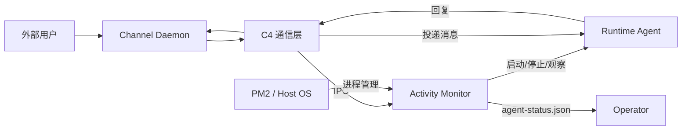
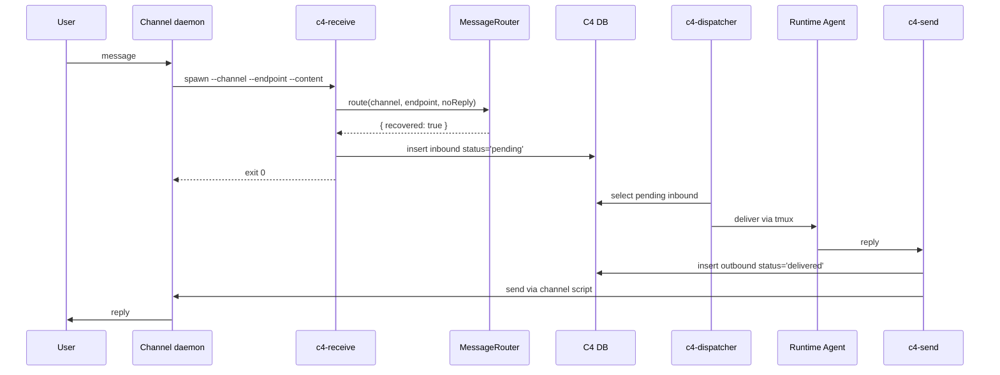

# Activity Monitor 技术方案

> 状态：Draft
> 日期：2026-04-28

---

## 1. Context：系统上下文

### 1.1 系统目标

Activity Monitor 是 Zylos runtime 的本地守护系统。它负责观察、诊断、恢复 Claude / Codex 等交互式 runtime，并在 runtime 不健康时让外部用户得到一致、可解释的反馈。

它不负责理解业务消息内容，也不负责判断"某条用户消息是否已经被 agent 回复"。这些仍由 agent 与 C4 通信层承担。

### 1.2 外部上下文

以 Activity Monitor 为中心，以下是与之交互的外部系统和角色：

| 外部上下文 | 定义 | 与 AM 的关系 | 职责边界 |
|---|---|---|---|
| 外部用户 | 通过 Lark / Telegram / Web Console / HXA-Connect 发消息的终端用户 | 消息经 C4 通信层到达 AM 的 MessageRouter | 用户不直接与 AM 交互；AM 通过 C4 通信层间接向用户返回状态文案 |
| C4 通信层 | 包含 c4-receive、c4-send、c4-dispatcher、C4 DB 的消息通信子系统 | c4-receive 通过 IPC 调用 AM 的 MessageRouter 获取路由决策；c4-receive 本身不判断健康状态，无状态，每次调用独立 | C4 负责消息的接收、持久化、投递、发送；AM 负责健康判断和路由决策。AM 不直接绕过 C4 主链向 runtime 投递用户消息 |
| Channel Daemon | 各平台（Lark / Telegram / Web Console）的入口进程 | 调用 c4-receive 后按 exit code 判断是否成功 | Channel Daemon 负责平台协议适配和消息收发；AM 对外状态只通过 `agent-status.json` 暴露，内部状态不泄漏给 Channel Daemon |
| Runtime Agent | Claude / Codex 交互式进程（运行在 tmux 中） | AM 启动、停止、观察 runtime；通过 Adapter 封装 runtime 差异 | AM 管理 runtime 生命周期和健康状态；runtime 负责业务消息处理。C4 Dispatcher 是用户消息进入 runtime 的唯一主链写入者 |
| Operator | 系统维护者 | 通过 `agent-status.json` 了解系统状态 | Operator 关注可观测状态和恢复策略 |
| PM2 / Host OS | 进程运行环境 | PM2 管理 AM 进程的长驻和重启 | PM2 负责进程生命周期；AM 在其上实现业务守护逻辑 |

### 1.3 上下文图



---

## 2. Containers：容器级架构

### 2.1 容器清单

按所属上下文分组：

#### Activity Monitor（本模块）

| Container | 类型 | 职责 | 入口交互 | 出口交互 |
|---|---|---|---|---|
| AM Process | PM2 long-running process | 主循环编排、状态机、runtime 生命周期管理。内部通过 signal files（JSON/JSONL）存取状态 | runtime 进程状态变化（退出/启动/冻结）；HealthEngine 健康状态转移；signal file 更新（工具事件、进程采样） | 启停 Runtime Agent Process；写 `agent-status.json` 对外暴露状态；触发健康目录动作（通知、重启决策） |
| MessageRouter | 一次性调用接口 | 接收 c4-receive 的路由请求，查询 AM 健康状态，返回路由决策（健康/不健康 + 用户文案） | c4-receive 调用 | 返回路由决策给 c4-receive |

#### C4 通信层

| Container | 类型 | 职责 | 入口交互 | 出口交互 |
|---|---|---|---|---|
| C4 Receive CLI | per-message Node process | 外部消息入口；调用 AM MessageRouter 获取路由决策并据此行动；写 inbound DB | Channel Daemon spawn 调用 | 写 C4 DB；通过 IPC 调用 AM MessageRouter；unhealthy 时调用 C4 Send CLI |
| C4 Send CLI | per-message Node process | agent/系统对外发送消息 | Runtime Agent 或 c4-receive 调用 | 写 C4 DB outbound；调用 Channel Daemon send script |
| C4 Dispatcher | PM2 long-running process | 消费 C4 DB 中 `status='pending'` 的 inbound，投递给 runtime | 轮询 C4 DB | 通过 tmux 投递给 Runtime Agent |
| C4 DB | SQLite | C4 消息可靠性边界，存储 inbound/outbound 消息记录 | c4-receive / c4-send / c4-dispatcher 读写 | 被 c4-dispatcher 消费 |

#### Channel Daemon

| Container | 类型 | 职责 | 入口交互 | 出口交互 |
|---|---|---|---|---|
| Channel Daemons | PM2/process | 平台协议适配（Lark / Telegram / Web Console 等），消息收发 | 外部用户消息到达 | spawn c4-receive 处理 inbound；被 c4-send channel script 调用发送 outbound |

#### Runtime Agent

| Container | 类型 | 职责 | 入口交互 | 出口交互 |
|---|---|---|---|---|
| Runtime Agent Process | tmux interactive process | 真实 agent 工作循环（Claude / Codex） | C4 Dispatcher 投递用户消息；AM 通过 Adapter 启停 | 调用 C4 Send CLI 回复用户 |

### 2.2 容器交互

#### OK 路径



#### Unhealthy 状态文案路径


---

## 3. Components：组件级设计

按容器分组。本方案聚焦 AM 容器和与之直接交互的 C4 容器组件。

### 3.1 AM Process 容器

| Component | 职责 | 输入 | 输出 |
|---|---|---|---|
| Runtime Adapter | DI 层，封装 Claude / Codex runtime 差异，向其他组件提供统一的 runtime 操作接口 | runtime config（runtime 类型、路径、参数） | launch/stop/probe/catalog/tool rules（统一接口，屏蔽 runtime 实现差异） |
| HealthEngine | 维护 HealthState FSM（OK/Unavailable/RateLimited/AuthFailed）的状态流转逻辑和触发动作。不在主循环 tick 中运行，由外部事件异步触发（见下方检测时机） | c4-dispatcher 的异步调用（user message 投递成功后）；check tmux pane / check auth 的检测结果 | HealthState 状态流转；触发动作（new session / restart） |
| Monitor Orchestrator | 主循环入口，每秒驱动一次 tick，按固定顺序调用各组件；负责启动 IPC 监听供 MessageRouter 接入 | 系统时钟（1s interval）、config | 按顺序调用各组件的 tick 方法 |
| SignalStore | tick 开头统一读取所有 signal files，生成当次 tick 的 immutable snapshot，供后续组件消费 | signal files（`agent-status.json`、`proc-state.json`、`api-activity.json` 等） | readonly snapshot（当次 tick 内所有组件共享同一份快照） |
| Guardian | 守护 runtime 进程存活：检测进程退出后无条件拉起，拉起失败时按退避策略递增延迟重试 | snapshot、guardian 内部状态（上次拉起时间、连续失败计数） | 调用 Runtime Adapter 拉起 runtime |
| ProcSampler | 通过 OS 级指标（pid 存活、context switch 计数）检测 runtime 进程是否冻结 | runtime pid、`/proc` context switch 数据 | `proc-state.json`（冻结检测结果，供 SignalStore 下次 tick 读取） |
| ToolPipeline | 从 runtime 产生的工具事件流中合成 API 活动摘要，判断 runtime 是否有近期活动 | `tool-events.jsonl`（runtime 写入的工具调用事件流） | `api-activity.json`（最近活动时间、活跃工具列表，供 ToolWatchdog 消费） |
| ToolWatchdog | 检测工具调用是否超时，超时则通过 Adapter 执行干预动作（如中断当前工具） | snapshot、Adapter 提供的工具超时规则 | 调用 Runtime Adapter 执行控制动作（中断/重启） |
| TaskScheduler | 统一管理定时任务（健康检查、日志清理、usage 告警等），按配置的 interval 触发执行 | 系统时钟、config 中的任务定义 | 任务执行结果；maintenance 状态文件 |
| StatusWriter | tick 末尾汇总当前 ActivityState、HealthState 及各组件状态，写入对外状态文件 | snapshot、HealthEngine 当前状态 | `agent-status.json`（Operator 和 MessageRouter 消费） |

#### Hook 脚本

Hook 脚本是 AM 的重要数据采集层。它们注册为 Claude Code 的异步 hook，在 runtime 运行过程中被触发，将事件写入 signal files 供主循环组件消费。Hook 本身不参与主循环 tick，而是作为 runtime 侧的事件采集器独立运行。

| Hook 脚本 | 触发时机 | 职责 | 输出 |
|---|---|---|---|
| hook-activity | UserPromptSubmit、PreToolUse、PostToolUse、PostToolUseFailure、Stop、Notification(idle_prompt) | 记录工具生命周期事件，追踪 runtime 前台/后台会话状态 | `tool-events.jsonl`（供 ToolPipeline 消费合成 `api-activity.json`） |
| hook-auth-prompt | PermissionRequest | 记录权限请求事件；当 auto_approve_permission 开启时，通过 C4 control channel 自动发送 Enter 按键确认 | `hook-timing.log`；可选的 C4 control 自动确认 |
| session-start-prompt | SessionStart | 会话启动时通过 C4 control queue 注入启动提示，触发 runtime 恢复工作或回复等待中的消息 | C4 control queue 消息 |

数据流：Hook 脚本 → signal files → SignalStore（tick 开头读取）→ snapshot → 各组件消费。

### 3.2 MessageRouter 容器

| Component | 职责 | 输入 | 输出 |
|---|---|---|---|
| MessageRouter | 接收 c4-receive 的 IPC 路由请求，查询 HealthEngine 当前健康状态；health≠OK 时触发或加入 recovery probe 聚合，等待 probe 结果后返回最终路由决策和用户文案 | c4-receive 发来的 IPC 请求（channel、endpoint、noReply）；HealthEngine 当前状态 | 路由决策：recovered=true 走主链，recovered=false 附带 reason 和 userMessage |

MessageRouter 不在 AM Process 主循环中运行；它由 `c4-receive` 通过 IPC 事件触发，是一次性调用接口。

路由规则：

- `health=OK` 时立即返回 recovered=true，消息走主链。
- `health!=OK` 时先检查本地缓存文件：缓存有效则直接使用，否则触发 recovery probe 并将结果写入缓存（带过期时间）。
- probe 成功返回 recovered=true，消息走主链。
- probe 失败返回 recovered=false 和最终用户文案。
- router probe budget 不超过 25s，给 `c4-send` 留出 5s 同步发送预算。
- `noReply=true` 的消息不得走 c4-send 状态文案路径。

`noReply` 语义：

- `noReply=false`（默认）：用户消息。probe 失败时 c4-receive 调 c4-send 向用户投递状态文案（"暂时不可用"等）。
- `noReply=true`：系统/内部消息（scheduler 定时任务、maintenance 命令、内部控制消息等），通过 c4-receive 的 `--no-reply` flag 标记，channel 默认为 `system`。probe 失败时静默返回 recovered=false，不调 c4-send，不产生任何用户可见输出。设计意图：系统消息没有"用户"需要通知，unhealthy 时不应产生无意义的状态文案噪音。

Recovery probe 方法（按当前 HealthState 分支）：

1. **RateLimited** → 执行 heartbeat probe（向 runtime 发送 heartbeat 并等待 ack）：
   - 预期时间内收到 ack → 流转到 OK
   - 未收到 ack → 执行 check tmux pane：
     - 识别到 rate limit 字符模式 → 仍为 RateLimited
     - 识别到 auth failed 字符模式 → 流转到 AuthFailed
     - 均未识别到 → 流转到 Unavailable
2. **AuthFailed** → 执行 check auth：
   - auth 通过 → 流转到 OK
   - auth 未通过 → 保持 AuthFailed
3. **Unavailable** → 执行 heartbeat probe（向 runtime 发送 heartbeat 并等待 ack）：
   - 预期时间内收到 ack → 流转到 OK
   - 未收到 ack → 执行 check tmux pane：
     - 识别到 rate limit 字符模式 → 流转到 RateLimited
     - 识别到 auth failed 字符模式 → 流转到 AuthFailed
     - 均未识别到 → 保持 Unavailable

Heartbeat 是 recovery probe 的内部探测手段，不作为独立定时检测任务。RateLimited 和 Unavailable 使用相同的 probe 方法（heartbeat → check tmux pane fallback），AuthFailed 使用 check auth。

userMessage 来源：HealthEngine 负责匹配 API error 与状态转换，MessageRouter 负责把 `reason` 映射为 `userMessage` 后返回给 c4-receive。c4-receive 不应自己维护第二份 catalog lookup，避免文案来源分裂。

路由逻辑：

```text
c4-receive IPC 请求到达
        │
        ▼
  ┌─────────────┐
  │ 读 HealthState │
  └──────┬──────┘
         │
    health=OK?
    ┌────┴────┐
    │ YES     │ NO
    ▼         ▼
 返回        ┌──────────────┐
 recovered   │ 触发/加入      │
 =true       │ recovery probe │
 (走主链)     │ 聚合 (≤25s)    │
             └──────┬───────┘
                    │
              probe 成功?
              ┌─────┴─────┐
              │ YES       │ NO
              ▼           ▼
           返回         noReply?
           recovered    ┌───┴───┐
           =true        │ YES   │ NO
           (走主链)      ▼       ▼
                      返回     返回
                      recovered recovered
                      =false   =false
                      (静默)    + reason
                               + userMessage
                               (c4-receive
                                调 c4-send
                                投递文案)
```

### 3.3 C4 通信层容器（与 AM 交互部分）

| Component | 职责 | 输入 | 输出 |
|---|---|---|---|
| c4-receive | 外部消息入口：Channel Daemon 收到用户消息后 spawn 本进程，负责写 inbound DB 并通过 IPC 调用 MessageRouter 获取路由决策 | Channel Daemon spawn 调用（携带 channel、endpoint、message）；MessageRouter 返回的 RouteDecision | 写 C4 DB inbound（status=pending）；健康时结束，不健康时调用 c4-send 向用户投递状态文案 |
| c4-send | 对外发送消息：将 agent 回复或系统状态文案写入 C4 DB outbound 并通过 Channel Daemon 投递给用户 | Runtime Agent 调用（正常回复）或 c4-receive 调用（unhealthy 状态文案） | 写 C4 DB outbound；调用 Channel Daemon send script 投递给用户 |

### 3.4 主循环顺序

```text
tick every 1s:
  1. SignalStore.refresh()
  2. Guardian.tick(snapshot)
  3. ProcSampler.tick(snapshot)
  4. ToolPipeline.tick(snapshot)
  5. ToolWatchdog.tick(snapshot)
  6. TaskScheduler.tick(snapshot)
  7. StatusWriter.write(snapshot, healthEngine)
```

HealthEngine 不参与主循环 tick，由事件异步触发（见下方检测时机说明）。

### 3.5 状态模型

#### ActivityState

| 状态 | 含义 | 来源 |
|---|---|---|
| Offline | tmux 或 runtime pid 不存在 | SignalStore + ProcSampler |
| Busy | hook fresh 且存在活跃工具或短时间内有输入 | ToolPipeline / hooks |
| Idle | runtime 存活但无近期活动 | SignalStore projection |

ActivityState 是无状态投射，不是 FSM。相同 signal snapshot 必须得到相同结果。

#### HealthState

| 状态 | 含义 | 从 OK 转入的依据 |
|---|---|---|
| OK | runtime 功能可用 | —（初始状态） |
| Unavailable | 兜底状态：排除 RateLimited 和 AuthFailed 后，其余所有不可用场景均归入此状态（D-2）。内部分 recovering / down 两阶段，对外统一暴露为 Unavailable（D-3） | 暂未明确 |
| RateLimited | 外部 API 限流 | 连续两次 check tmux pane 识别到 rate limit 字符模式 |
| AuthFailed | 凭证或认证失败 | check tmux pane 识别到认证失败字符模式后，执行 check auth 确认 auth 确实失败 |

状态机为全连通（OK ↔ Unavailable ↔ RateLimited ↔ AuthFailed），由 HealthEngine 独占维护。各状态的转出路径由 recovery probe 方法决定（详见 §3.2 MessageRouter 容器）。Guardian 不读取 HealthEngine 内存字段，只通过 SignalStore 读取必要的 rate-limit / maintenance 文件。

#### OK → 非 OK 检测时机

HealthState 从 OK 转出不再由主循环定时检测，改为 **user message 事件触发**（利用事件驱动机制更快发现异常）：

1. c4-dispatcher 成功将 user message 投递给 runtime agent
2. c4-dispatcher 异步调用 HealthEngine 接口
3. HealthEngine 等待约 5s（给 runtime 处理时间）
4. 执行 check tmux pane，按字符模式匹配结果决定状态流转：
   - 连续两次识别到 **rate limit** 字符模式 → 流转到 RateLimited
   - 识别到 **auth failed** 字符模式 → 执行 check auth 确认确实失败 → 流转到 AuthFailed
   - 识别到 **corrupted image** 等 sticky error 字符模式 → 执行 new session 或 restart
   - 未识别到异常 → 保持 OK

---

## 4. Code：代码级落地方案

### 4.1 目录结构

```
activity-monitor/
├── scripts/
│   ├── monitor.js               # 入口 + 主循环编排层
│   ├── guardian.js               # 进程存活守护
│   ├── health-engine.js          # 健康状态机
│   ├── message-router.js         # 用户消息路由（事件驱动）
│   ├── signal-store.js           # 信号聚合读取
│   ├── status-writer.js          # agent-status.json 写入
│   ├── task-scheduler.js         # 统一定时任务调度器
│   ├── proc-sampler.js           # 进程冻结检测（保留）
│   ├── hook-activity.js          # Hook 脚本
│   ├── hook-auth-prompt.js       # Hook 脚本
│   ├── context-monitor.js        # Hook 脚本
│   ├── session-start-prompt.js   # Hook 脚本
│   ├── tasks/                    # 注册式定时任务
│   │   ├── daily-upgrade.js
│   │   ├── daily-memory-commit.js
│   │   ├── upgrade-check.js
│   │   ├── health-check.js       # PM2/disk/memory
│   │   ├── usage-monitor.js
│   │   └── context-check.js      # 上下文占用检查（Codex 轮询 + Claude statusLine 二次判断）
│   └── adapters/                 # 运行时适配器（依赖注入）
│       ├── claude.js
│       └── codex.js
```

> 代码级详细设计（伪代码、接口定义、数据库语义等）将在后续迭代中补充。

---

## 5. 关键决策纪要

> 本节记录方案设计过程中的关键技术决策。每条标注确认状态（已确认 / 待确认）。
> 来源：PR #501 评审记录。

### 架构

#### D-1. ActivityState 与 HealthState 双层正交

**状态**：已确认
**决策**：ActivityState（Offline/Idle/Busy）管理进程生命周期，HealthState（OK/Unavailable/RateLimited/AuthFailed）管理功能健康，两层完全正交。HealthEngine 不读 ActivityState 决定自身状态，Guardian 不读 HealthState 决定是否拉起。

#### D-2. HealthState 保持 4 种枚举，不新增

**状态**：已确认
**决策**：HealthState 保持 OK / Unavailable / RateLimited / AuthFailed 四种。诊断信息通过 `agent-status.json` 的 `unavailable_reason` 字段暴露，消费端做差异化文案，不为具体 error 类型新增状态枚举。

#### D-3. recovering + down 合并为 Unavailable

**状态**：已确认
**决策**：对外只暴露 `health: "unavailable"`，不暴露内部子状态。消费端基于 `unavailable_since` 时间戳自行判断（如 < 60min "稍后重试"，>= 60min "需管理员介入"）。

#### D-4. 主循环 7 步 tick 编排

**状态**：已确认
**决策**：AM 主循环每 tick 按固定顺序执行 7 步：SignalStore.refresh → Guardian → ProcSampler → ToolPipeline → ToolWatchdog → TaskScheduler → StatusWriter。HealthEngine 不参与主循环 tick，改为由 user message 事件异步触发（事件驱动机制更快发现异常）。

#### D-5. Runtime 差异通过 Adapter 依赖注入

**状态**：已确认
**决策**：业务模块不做 runtime 分支判断，所有 Claude / Codex 差异通过 Adapter DI 注入。Adapter 接口包含 6 类：标识、进程管理、健康检查、API error catalog、运行时差异、消息写入/tmux。

#### D-6. 模块拆分为 10 业务组件 + 1 Adapter

**状态**：已确认
**决策**：拆分为 SignalStore、StatusWriter、Guardian、ProcSampler、HealthEngine、MessageRouter、ToolPipeline、ToolWatchdog、TaskScheduler、SessionRestartContinuation + RuntimeAdapter。InputValidator 移出 baseline（见 D-28）。

### Unhealthy 路径

#### D-7. MessageRouter 事件驱动 + probe 结果缓存

**状态**：已确认
**决策**：MessageRouter 由 c4-receive IPC 事件驱动，不做定时轮询。当 health≠OK 时，每个请求先检查本地缓存文件：若缓存有效则直接使用；若缓存过期或不存在，则触发一次 recovery probe 并将结果写入缓存（带过期时间）。采用 IPC 通信 + 30s 硬超时 + 降级 fallback 方案。

#### D-8. Unhealthy 路径即时双写 DB + c4-send 投递状态文案

**状态**：已确认
**决策**：health 非 OK 时，c4-receive 通过 MessageRouter IPC 探测后若仍异常：(1) insertConversation('in', ..., 'delivered') 记录用户输入，dispatcher 自然跳过；(2) spawn c4-send.js 投递 catalog.userMessage 给用户。用户即时收到状态回复。

#### D-9. 废弃 pending-channels.jsonl 异步恢复广播

**状态**：已确认
**决策**：unhealthy 路径已即时返回状态文案，不需要事后异步"我恢复了"广播。pending-channels.jsonl 完全废弃。

#### D-10. Health 状态持久化 + 未知默认 OK

**状态**：已确认
**决策**：Health 状态不区分"首次启动"和"故障恢复"。health 未知时默认为 OK；每次启动 runtime agent 时直接沿用当前 health 状态（如重启前为 RateLimited，重启后仍为 RateLimited）。MessageRouter 机制保证 health≠OK 时消息仍能被正确处理，无需特殊的启动宽限期。

### C4 DB 语义与消息可靠性

#### D-11. C4 DB 是消息可靠性边界，delivered-but-unanswered ≠ 数据丢失

**状态**：已确认
**决策**：accepted inbound 即持久化到 C4 DB，AM 不维护二级 ledger。runtime failure 后用户消息未回复是"未回复"不是"丢消息"。session restart 后 c4-session-init 注入 unsummarized context，agent 自治决定是否补答。

#### D-12. 不引入受害者识别 ledger

**状态**：已确认
**决策**：不引入 recent-inbound.jsonl、restart-in-progress.json intake barrier、recent-inbound.lock 等机制。AM 不越界扩张到 C4 的 message lifecycle 领地。

#### D-13. 不引入 unanswered inbound 推断机制

**状态**：已确认
**决策**：是否"已回复"难以可靠判定（group / multi-message 场景假阳性大）。Session bootstrap 通过 c4-session-init 注入 recent conversation context，agent 自决定是否 follow-up。

#### D-14. status='delivered' 显式覆盖，不引入新 DB 字段

**状态**：已确认
**决策**：unhealthy 路径 inbound 用 insertConversation 显式传 'delivered'，dispatcher `WHERE status='pending'` 自然跳过。不引入 terminal_status / reply_to_inbound_id / claimed_at 等新字段。

#### D-15. Session restart continuation 采用 best-effort contract

**状态**：已确认
**决策**：三句 contract：(1) accepted-message durability（C4 DB 持久化）；(2) best-effort continuation（c4-session-init 注入 recent context）；(3) 不承诺 completeness，漏答是可接受的 UX 风险。

### Probe / Restart 与 Error 处理

#### D-16. Probe 与 restart 解耦

**状态**：已确认
**决策**：heartbeat/probe 失败不默认 trigger restart。只有 recoveryAction=restart_session 的 error 类型（如 sticky context-poison）才触发 restart。rate_limited / auth_failed / probe_only 路径不 restart。

#### D-17. Catalog-driven API error 分类 + 5 种 recoveryAction

**状态**：已确认
**决策**：Adapter 注入 getApiErrorPatterns() 返回 catalog 数组，5 种 recoveryAction：restart_session / probe_only / mark_rate_limited / mark_auth_failed / notify_only。Unknown error fallback 走 probe_only + 落 unknown-api-errors.jsonl 累积学习。

#### D-18. Sticky context 场景保留 session restart 自愈

**状态**：已确认
**决策**：图片损坏等导致的 sticky API error（400 / invalid_request_error）保留 adapter.stop() 强制 restart。连续 2 次命中防抖（30s 间隔），命中后 HealthEngine 调 adapter.stop()，Guardian 下一 tick 拉起新 session。

#### D-19. Unknown error 持续 5min 升级为 restart_session

**状态**：已确认
**决策**：同一 unknown pattern 连续 10 次扫描命中（30s × 10 = 5min）时，recoveryAction 从 probe_only 升级到 restart_session，防止 sticky context 下 probe 永远失败导致长期 stuck。

### Guardian 行为

#### D-20. Guardian 无条件拉起 + 失败退避

**状态**：已确认
**决策**：Guardian 原则为"Offline → 无条件拉起进程"，不读 HealthState。拉起失败后通过退避逻辑（递增延迟）避免无限快速重启。进程状态与健康状态完全正交，Guardian 不因 RateLimited 或任何 HealthState 阻止拉起。

#### D-21. AM 冷启动时 Guardian 退避状态重置

**状态**：已确认
**决策**：PM2 重启 AM 自身时，Guardian 不从磁盘恢复 notRunningCount / consecutiveRestarts / restartDelay 等持久化计数器。AM 冷启动 = Guardian 全新开始，立即尝试拉起 tmux。

### SignalStore

#### D-22. 分为快照层和流式层

**状态**：已确认
**决策**：快照层（readJSON 读取 statusline.json / foreground-session.json 等）和流式层（有状态增量读取 tool-events.jsonl，维护 offset / inode / 轮转 drain）。两层输出合并为 immutable signals snapshot。

#### D-23. 跨模块状态走 SignalStore，不直接读其他模块私有数据

**状态**：已确认
**决策**：组件间通信通过 SignalStore 只读快照（eventual consistency）和显式接口调用。如 HealthEngine 不直接查 C4 DB。

### Tool Pipeline 与 Watchdog

#### D-24. ToolWatchdog 作为主循环独立组件

**状态**：已确认
**决策**：ToolWatchdog 是有状态的干预系统（5 阶段状态机 + 持久化 + 主动按键中断），不是无状态健康检查，不归入 health-checks 子系统。

#### D-25. frozen 为瞬态，不需要独立 ActivityState 枚举

**状态**：已确认
**决策**：ProcSampler 检测到冻结后 kill 会话，下一 tick 自然进入 Offline → Guardian 拉起。frozen 不需要独立枚举值，但 agent-status.json 可瞬时写入 state: 'frozen' 供日志使用。

### 任务调度

#### D-26. usage_monitor 与 usage_alert 拆为两个独立 gate

**状态**：已确认
**决策**：拆为 usage_monitor_enabled（默认 true，本地 state 刷新，零 token）和 usage_alert_enabled（默认 false，达阈值时 C4 enqueue alert）。两个独立 TaskScheduler 任务。

#### D-27. 升级兼容策略：旧 config 默认告警关闭

**状态**：已确认
**决策**：旧 config 只有 usage_monitor_enabled=true 时，新版 default usage_alert_enabled=false。启动检测 legacy config 输出 warning，鼓励 opt-in。

### HealthEngine 接口

#### D-28. HealthEngine 暴露 triggerRecovery() 和 onAuthFailed()

**状态**：已确认
**决策**：最终接口：health / restartBlocked / onProcessRestarted() / onAuthFailed(reason) / triggerRecovery(reason) / notifyUserMessage() / tick(signals)。enterRateLimited 和 requestImmediateProbe 由 tick() 内部管理不暴露。

#### D-29. triggerRecovery 在 Unavailable 内按时间区分行为

**状态**：待确认
**决策**：进入 Unavailable < 60min 时接受 triggerRecovery，>= 60min 时拒绝（避免长时间故障下反复 kill+restart）。

#### D-30. rate-limit 检测从被动改为主动 30s 扫描

**状态**：待确认
**决策**：30s 主动 tmux 扫描检测限流，替代当前被动触发。需考虑误报风险（session 内容中的 "rate limit" 文本可能误触发）。

### 其他

#### D-31. InputValidator 不做

**状态**：已确认
**决策**：当前架构下图片作为路径文本传递，agent 通过 Read 工具加载（自带 size/format 边界），不触发 API 4xx。未来若新增 multimodal 直接注入路径，入口校验应放在该注入点。

#### D-32. Adapter catalog 字段统一命名 recoveryAction

**状态**：已确认
**决策**：catalog entry 字段统一为 `recoveryAction`，不支持 `action` alias，避免字段漂移。

#### D-33. startupGrace 与 launchGracePeriod 不合并

**状态**：已确认
**决策**：startupGrace (30s) 是 AM 自身启动等待窗口，launchGracePeriod (180s) 是 runtime 拉起后探测宽限期，作用域不同，不合并。

#### D-34. C4 DB schema 扩展（terminal_status 等）全部不引入

**状态**：已确认
**决策**：不引入 terminal_status 列、reply_to_inbound_id 列、claimed_at 列、dispatcher claim + reply command token-passing 机制。用既有 status='delivered' 字段值满足 unhealthy 路径需求，保持 C4 DB schema 不变。

### 容器契约

#### D-35. C4 DB durability

**状态**：已确认
**决策**：`c4-receive` 写入 `status='pending'` 后，该消息才算被主链接受。

#### D-36. no double delivery

**状态**：已确认
**决策**：unhealthy inbound 必须写 `status='delivered'`，dispatcher 不得再投递给 runtime。

#### D-37. single real answer

**状态**：已确认
**决策**：每次 `c4-receive` 最多产生一种用户可见结果：后续 agent 真回复，或同步状态文案，或 terminal error。

#### D-38. runtime independence

**状态**：已确认
**决策**：Claude / Codex 差异只进入 Adapter，不进入 HealthEngine / Guardian 分支逻辑。

---
