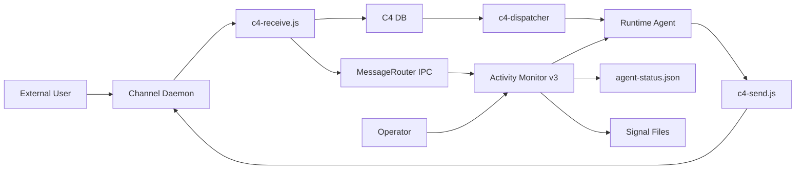
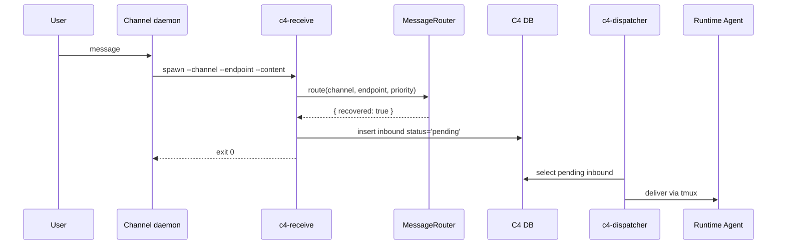
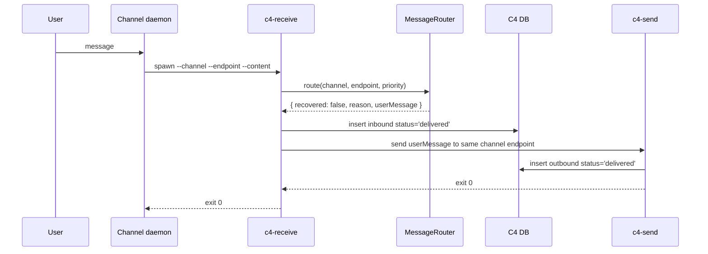

# Activity Monitor v3 技术方案（C4 模型版）

> 状态：Review Draft
> 日期：2026-04-28
> 适用范围：PR #501 `docs/activity-monitor-refactor-proposal`
> 来源：基于 `activity-monitor-refactor-proposal-v3.md` 与 9 份模块实施档重新梳理

---

## 0. 审核结论

现有 v3 方向是正确的：它把 Activity Monitor 从单体守护脚本重构为运行时无关的监控编排层，并保留了 v2.1 已经收敛的生产取舍：

- C4 DB 仍然是消息可靠性边界，AM 不重新实现 reply ledger。
- ActivityState 与 HealthState 正交，进程是否存活不等于 runtime 是否健康。
- Runtime 差异通过 Adapter 注入，不在业务模块里硬编码 Claude / Codex 分支。
- API error 治理从硬编码 if/else 升级为 catalog-driven dispatch。
- session restart continuation 只承诺 best-effort，不假装有完整 unresolved-inbound 语义。

但原文档仍有 4 个必须在实现前收口的问题：

| 风险 | 问题 | 本版收口 |
|---|---|---|
| R1 | `catalog.userMessage` 的归属不清，`unavailable_reason` 不能直接当用户文案发送 | 明确由 HealthEngine/Adapter catalog 提供 reason->message 映射；MessageRouter 返回 `userMessage`，c4-receive 不自行查 catalog |
| R2 | `--no-reply` / `system` 消息在 unhealthy 路径下可能调用不存在的 channel send 脚本 | 明确 `noReply=true` 不走 external c4-send 状态文案路径，只写 control/system 处理结果或 terminal success |
| R3 | c4-send 外部投递失败时，DB audit 可能先写 outbound delivered，造成“DB 显示已发但用户没收到” | 明确 c4-send 需要返回结构化 exit 语义；c4-receive 只在 send 成功后返回 unhealthy success，失败时写诊断并返回 channel daemon terminal error |
| R4 | 30s MessageRouter probe 超时与 c4-send/channel send 耗时共用预算，容易边界超时 | 明确 probe budget 与 send budget 分离：router probe <= 25s，c4-send <= 5s，整体 receive 上限 30s |

本版不是引入新大机制，而是把现有 v3 方案按 C4 模型重排，并把上述 4 个点作为实现前的 contract 修订。

---

## 1. Context：系统上下文

### 1.1 系统目标

Activity Monitor v3 是 Zylos runtime 的本地守护系统。它负责观察、诊断、恢复 Claude / Codex 等交互式 runtime，并在 runtime 不健康时让外部用户得到一致、可解释的反馈。

它不负责理解业务消息内容，也不负责判断“某条用户消息是否已经被 agent 回复”。这些仍由 agent 与 C4 通信层承担。

### 1.2 外部参与者

| 参与者 | 关系 | 关心的问题 |
|---|---|---|
| 外部用户 | 通过 Lark / Telegram / Web Console / HXA-Connect 发消息 | 消息是否被接收；runtime 不健康时是否收到清晰反馈 |
| Channel daemon | 各平台入口进程 | 调用 `c4-receive.js` 后按 exit code 判断是否成功 |
| C4 Dispatcher | C4 主链投递器 | 只消费 `conversations.status='pending'` 的 inbound |
| Runtime Agent | Claude / Codex 进程 | 接收 C4 投递的用户消息并回复 |
| Operator | 系统维护者 | 需要可观测状态、恢复策略、回滚路径 |
| PM2 / Host OS | 进程运行环境 | 负责长驻进程、重启与资源信号 |

### 1.3 上下文图



### 1.4 核心上下文边界

- AM 可以启动、停止、观察 runtime，但不直接绕过 C4 主链向 tmux 投递用户消息。
- `c4-dispatcher` 仍是用户消息进入 runtime 的唯一主链写入者。
- `c4-receive` 是 unhealthy 用户反馈的同步决策点，但不成为长期状态机。
- 对外状态只通过 `agent-status.json` 暴露，内部状态不泄漏给 channel daemon。

---

## 2. Containers：容器级架构

### 2.1 容器清单

| Container | 类型 | 职责 | 持久化/接口 |
|---|---|---|---|
| Activity Monitor Process | PM2 long-running process | 主循环、状态机、runtime 恢复、MessageRouter 宿主 | signal files, local IPC |
| Runtime Adapter | AM 内部 DI 层 | 封装 Claude / Codex 差异 | JS interface |
| C4 Receive CLI | per-message Node process | 外部消息入口；健康路由；写 inbound DB | CLI, C4 DB |
| C4 Send CLI | per-message Node process | agent/系统对外发送消息 | CLI, C4 DB, channel send scripts |
| C4 DB | SQLite | C4 消息可靠性边界 | `conversations`, `control_queue` |
| Channel Daemons | PM2/process | 平台消息收发 | channel APIs |
| Runtime Agent Process | tmux interactive process | 真实 agent 工作循环 | tmux pane |
| Signal Files | local files | AM 与其他组件的低耦合状态通道 | JSON/JSONL files |

### 2.2 容器交互

#### OK 路径



#### Unhealthy 状态文案路径



### 2.3 关键容器契约

| 契约 | 内容 |
|---|---|
| C-1 C4 DB durability | `c4-receive` 写入 `status='pending'` 后，该消息才算被主链接受 |
| C-2 no double delivery | unhealthy inbound 必须写 `status='delivered'`，dispatcher 不得再投递给 runtime |
| C-3 single real answer | 每次 `c4-receive` 最多产生一种用户可见结果：后续 agent 真回复，或同步状态文案，或 terminal error |
| C-4 no reply ledger | 不引入 `terminal_status` / `reply_to_inbound_id` / token-passing |
| C-5 runtime independence | Claude / Codex 差异只进入 Adapter，不进入 HealthEngine / Guardian 分支逻辑 |

---

## 3. Components：组件级设计

### 3.1 Activity Monitor 内部组件

| Component | 所属容器 | 职责 | 输入 | 输出 |
|---|---|---|---|---|
| Monitor Orchestrator | AM Process | 每秒 tick 编排；启动 IPC | clock, config | component calls |
| SignalStore | AM Process | tick 开头读信号，产出 immutable snapshot | signal files | readonly snapshot |
| StatusWriter | AM Process | tick 末尾写对外状态 | snapshot, HealthEngine | `agent-status.json` |
| Guardian | AM Process | runtime 进程存活守护 | snapshot, guardian state | `adapter.launch()`, HealthEngine events |
| ProcSampler | AM Process | OS 级冻结检测 | pid/context switch | `proc-state.json` |
| ToolPipeline | AM Process | 工具事件流合成 | `tool-events.jsonl` | `api-activity.json` |
| ToolWatchdog | AM Process | 工具超时干预 | snapshot, adapter rules | adapter control action |
| HealthEngine | AM Process | HealthState FSM + catalog dispatch | snapshot, Adapter catalog | health state, rate-limit state |
| TaskScheduler | AM Process | 统一定时任务 | time, config | task execution, maintenance state |
| MessageRouter | AM Process | c4-receive 路由 IPC + probe 聚合 | IPC request, HealthEngine | route decision |
| Runtime Adapter | AM Process | runtime-specific 操作 | runtime config | launch/stop/probe/catalog/tool rules |

### 3.2 主循环顺序

```text
tick every 1s:
  1. SignalStore.refresh()
  2. Guardian.tick(snapshot)
  3. ProcSampler.tick(snapshot)
  4. ToolPipeline.tick(snapshot)
  5. ToolWatchdog.tick(snapshot)
  6. HealthEngine.tick(snapshot)
  7. TaskScheduler.tick(snapshot)
  8. StatusWriter.write(snapshot, healthEngine)
```

顺序约束：

- ToolPipeline 必须在 HealthEngine 前，因为 API activity 是健康判断输入。
- ToolWatchdog 必须在 HealthEngine 前，因为干预结果可能改变健康判断。
- MessageRouter 不在 tick 中运行；它由 `c4-receive` 通过 IPC 事件触发。

### 3.3 状态模型

#### ActivityState

| 状态 | 含义 | 来源 |
|---|---|---|
| Offline | tmux 或 runtime pid 不存在 | SignalStore + ProcSampler |
| Busy | hook fresh 且存在活跃工具或短时间内有输入 | ToolPipeline / hooks |
| Idle | runtime 存活但无近期活动 | SignalStore projection |

ActivityState 是无状态投射，不是 FSM。相同 signal snapshot 必须得到相同结果。

#### HealthState

| 状态 | 含义 | 恢复路径 |
|---|---|---|
| OK | runtime 功能可用 | 无 |
| Unavailable | API error、heartbeat fail、probe fail 等一般不可用 | 指数退避 probe |
| RateLimited | 外部 API 限流 | 冷却到期后转 Unavailable |
| AuthFailed | 凭证或认证失败 | 180s 冷却或 user message 触发 auth-check |

HealthState 是 FSM，由 HealthEngine 独占维护。Guardian 不读取 HealthEngine 内存字段，只通过 SignalStore 读取必要的 rate-limit / maintenance 文件。

### 3.4 Catalog-driven API Error Dispatch

Adapter 提供 catalog entry：

```ts
type ApiErrorCatalogEntry = {
  id: string
  pattern: RegExp | string
  severity: 'sticky' | 'transient' | 'permanent'
  recoveryAction:
    | 'restart_session'
    | 'probe_only'
    | 'mark_rate_limited'
    | 'mark_auth_failed'
    | 'notify_only'
  debounce: number
  scanInterval: number
  userMessage: string
}
```

HealthEngine 负责匹配与状态转换；MessageRouter 负责把 `reason` 映射为 `userMessage` 后返回给 `c4-receive`。`c4-receive` 不应该自己维护第二份 catalog lookup，避免文案来源分裂。

### 3.5 MessageRouter contract

请求：

```ts
type RouteRequest = {
  channel: string
  endpoint?: string
  priority: 1 | 2 | 3
  noReply: boolean
}
```

响应：

```ts
type RouteDecision =
  | { recovered: true }
  | {
      recovered: false
      reason: 'unavailable' | 'rate_limited' | 'auth_failed'
      userMessage: string
    }
```

规则：

- `health=OK` 时立即返回 `recovered=true`。
- `health!=OK` 时触发/加入 recovery probe 聚合。
- probe 成功返回 `recovered=true`，消息走主链。
- probe 失败返回 `recovered=false` 和最终用户文案。
- router probe budget 不超过 25s，给 `c4-send` 留出 5s 同步发送预算。
- `noReply=true` 的消息不得走 external c4-send 状态文案路径。

---

## 4. Code：代码级落地方案

### 4.1 目标文件与新增/修改点

| 文件/模块 | 变更 |
|---|---|
| `skills/activity-monitor/monitor.js` | 主入口拆成 orchestrator；启动 MessageRouter IPC |
| `skills/activity-monitor/lib/signal-store.js` | 新增 SignalStore |
| `skills/activity-monitor/lib/status-writer.js` | 新增 StatusWriter |
| `skills/activity-monitor/lib/guardian.js` | 新增 Guardian |
| `skills/activity-monitor/lib/health-engine.js` | 新增 HealthEngine |
| `skills/activity-monitor/lib/message-router.js` | 新增 MessageRouter |
| `skills/activity-monitor/lib/runtime-adapters/*.js` | 新增 Claude / Codex Adapter |
| `skills/comm-bridge/scripts/c4-receive.js` | 接入 MessageRouter；改造 unhealthy 路径 |
| `skills/comm-bridge/scripts/c4-send.js` | 增加结构化发送结果与超时控制 |
| `skills/comm-bridge/scripts/c4-dispatcher.js` | 确认 health 值域 4 态兼容；继续只消费 pending inbound |

### 4.2 c4-receive 改造伪代码

```js
const route = await messageRouter.route({
  channel,
  endpoint,
  priority,
  noReply
}, { timeoutMs: 25000 })

if (route.recovered) {
  const record = insertConversation('in', channel, endpoint, dbContent, 'pending', priority, requireIdle)
  return emitSuccess(record.id)
}

if (noReply) {
  // system/control message has no external user endpoint to notify.
  const record = insertConversation('in', channel, endpoint, dbContent, 'delivered', priority, requireIdle)
  return emitSuccess(record.id, { delivered_status: route.reason, no_reply: true })
}

const inbound = insertConversation('in', channel, endpoint, dbContent, 'delivered', priority, requireIdle)
const send = await c4Send(channel, endpoint, route.userMessage, { timeoutMs: 5000 })

if (send.ok) {
  return emitSuccess(inbound.id, { delivered_status: route.reason })
}

logDeliveryFailure('unhealthy-status-message', inbound.id, send.error)
return emitError('STATUS_MESSAGE_DELIVERY_FAILED', '系统状态消息投递失败，请稍后重发')
```

### 4.3 c4-send 修订要求

当前 `c4-send.js` 会先写 outbound DB，再 spawn channel send script。v3 unhealthy 路径依赖它表达“用户是否真的收到状态文案”，因此需要补齐：

- 增加 child process timeout，默认 5s。
- 返回结构化结果：`ok`, `channel`, `endpoint`, `outboundId`, `exitCode`, `error`。
- channel send 失败时写诊断日志。
- 保持 CLI stdout/backward compatibility；结构化模式可通过 `--json` 启用。
- 不改变正常 agent reply 调用方式。

是否要把 outbound DB 写入从“send 前”改为“send 后”，需要单独确认。保守方案是保持现状，但新增 `delivery-failures.log` 诊断；严格方案是新增 outbound status 语义。考虑 v3 明确不扩展 C4 DB schema，本版建议采用保守方案。

### 4.4 noReply/system 处理

`--no-reply` 代表调用方不希望追加 reply via suffix，常见于 system/control 消息。此类消息没有稳定的用户 endpoint，不应该尝试发送 external 状态文案。

规则：

- `noReply=false`：unhealthy 时可用 `c4-send` 给用户发状态文案。
- `noReply=true`：unhealthy 时写 inbound `status='delivered'` 或直接 terminal success，但不调用 `c4-send`。
- 如果 `channel='system'`，`c4-send system ...` 不属于合法外部投递路径。

### 4.5 数据库语义

继续复用 `conversations.status`：

| direction | status | 语义 |
|---|---|---|
| in | pending | 已被主链接受，等待 dispatcher 投递给 runtime |
| in | delivered | 已由 c4-receive 同步处理，不进入 dispatcher |
| out | delivered | 已由 c4-send 写入 outbound audit |
| in | failed | dispatcher 投递失败后标记 |

不新增：

- `terminal_status`
- `reply_to_inbound_id`
- `claimed_at`
- unresolved-inbound exposure CLI
- reply command token-passing

### 4.6 超时预算

`c4-receive` 总预算维持 30s，但拆成两段：

| 阶段 | 上限 | 失败行为 |
|---|---:|---|
| MessageRouter route/probe | 25s | 走 generic unavailable 文案 |
| c4-send 状态文案投递 | 5s | 返回 terminal error，记录 delivery failure |

MessageRouter 内部 probe 可以继续运行，不因 c4-receive timeout 中断聚合池。

---

## 5. 迁移路线

| Phase | 范围 | 验收 |
|---|---|---|
| 0 | 保留现状；补文档 contract | 本文档与模块档一致 |
| 1 | 新增 SignalStore / StatusWriter / TaskScheduler / Adapter skeleton | feature flag 下单测通过 |
| 2 | 拆 Guardian / HealthEngine / ToolPipeline / ToolWatchdog / ProcSampler | legacy 与新入口可切换 |
| 3 | 上 MessageRouter IPC；改 c4-receive unhealthy 路径 | 5 路径不变量测试通过 |
| 4 | c4-send 结构化结果与 timeout；channel E2E | Lark/Telegram/Web Console unhealthy 体感一致 |
| 5 | 观察一周后删除 legacy drain pending-channels 路径 | grep legacy health error/pending-channels 写入为 0 |

---

## 6. 测试矩阵

### 6.1 单元测试

| 模块 | Case |
|---|---|
| SignalStore | 文件缺失/损坏 fail-open；snapshot tick 内 immutable |
| Guardian | 4 拉起条件；bypass-once；marker reset |
| HealthEngine | catalog 5 action；unknown 5min 升级；probe/restart 解耦 |
| MessageRouter | OK、probe recovered、probe failed、timeout、concurrent aggregation |
| c4-receive | pending insert；delivered insert；noReply unhealthy；c4-send failure |
| c4-send | send success；send non-zero；timeout；missing channel script |

### 6.2 E2E 测试

| 路径 | 预期 |
|---|---|
| OK user message | inbound pending，dispatcher 投递，agent 回复 |
| Unavailable user message | inbound delivered，outbound 状态文案，dispatcher 不投递 inbound |
| RateLimited user message | 用户收到限流文案，runtime 不重启 |
| AuthFailed user message | 用户收到凭证问题文案，auth-check 可被 user message 加速 |
| MessageRouter IPC down | 不写 DB，channel daemon 收到 terminal error |
| c4-send failure | inbound delivered + diagnostic；channel daemon 收到 terminal error |
| restart continuation | startup context 注入 recent/unsummarized，agent best-effort 判断是否补答 |

---

## 7. 回滚与兼容性

- Hook 路径不变，用户 settings 不需要改。
- `agent-status.json` 加 `schema_version=2`，旧消费端遇未知字段忽略。
- `c4-receive` CLI 参数不变。
- `c4-send` 默认 CLI 行为不变，新增 `--json` / timeout 是兼容扩展。
- Phase 2-4 保留 legacy AM 入口，PM2 启动参数可回滚。
- Phase 5 删除 legacy 前需要至少一周线上观察。

---

## 8. Reviewer Checklist

实现前必须确认：

- [ ] MessageRouter 是否返回 `userMessage`，避免 c4-receive 维护第二份 catalog。
- [ ] `--no-reply` / `system` unhealthy 路径是否不调用 external c4-send。
- [ ] c4-send 失败时的用户体感、DB audit、诊断日志是否一致。
- [ ] 25s + 5s 的超时预算是否被测试覆盖。
- [ ] `status='delivered'` inbound 是否在 dispatcher SQL 中自然跳过。
- [ ] restart continuation 文案是否明确是 best-effort，而不是完整 pending guarantee。
- [ ] 所有文档是否删除 `pending-channels.jsonl` 恢复广播作为 baseline 的描述。

---

## 9. 与现有文档的关系

本文是面向 reviewer 与实现者的 C4 模型版主方案，建议作为新的顶层阅读入口。原文档仍保留作为历史与详细取舍来源：

- `activity-monitor-refactor-proposal-v3.md`：原 v3 顶层方案与取舍说明。
- `activity-monitor/modules/*.md`：模块实施档。
- 本文：按 Context / Containers / Components / Code 重新组织后的技术方案与 contract 修订清单。
